# Nextcloud amb Collabora i Onlyoffice

*Andreu Pasalamar Carbó*

*Carles Grilló Oller*

## Índex

1. [Què és Nextcloud?](#quees)
2. [Collabora](#colla)
3. [Onlyoffice](#only)
4. [Versió 1](#v1)
5. [Versió 2](#v2)
6. [Versió 3](#v3)
7. [Versió 4](#v4)
8. [Versió 5](#v5)
9. [Autenticació d'usuaris per LDAP](#authldap)
10. [Comparació entre Nextcloud i Google](#comp)
11. [Sicronització: Nextcloud i Google](#sync)
12. [Conclusió](#end)

## Què és Nextcloud?<span id="quees"/>


Nextcloud és un aplicatiu per compartir i sincronitzar arxius amb la
característica de que el pots instalar a un servidor propi. Pots compartir múltiples
directoris i fitxers, i inmediatament es sincronitzen al servidor i a la resta de dispositius.

Es pot accedir al Nextcloud des de la direcció del servidor, afegint el compte de Nextcloud a
un sistema GNU+Linux,des d'un aplicatiu per escriptori, des d'Android i des d'un dispositiu iOS

## Per què utilitzar Nextcloud?

És una eina de codi obert i ofereix una molt bona alternativa a tenir documentació sensible al núvol,
a mans de serveis privatius. A més, es de fàcil gestió per part de l'administrador i conté aplicacions
internes de molts tipus, variant entre eines comunicatives, edició d'arxius i oci.

## Collabora. L'editor de text derivat de LibreOffice<span id="colla"/>


Collabora és un packet d'editors col·laboratius per treballar amb documents, fulls de càlcul i
presentacions de diferents formats. És de codi obert, segur i allotjat al propi servidor del Nextcloud.

*Collabora Development Edition* és gratuït, però està en continu desenvolupament i no està garantitzat
que sigui estable.

L'eina es pot utilitzar des del navegador i dispositius mòbils.

## Onlyoffice: La suite completa de productivitat<span id="only"/>


Onlyoffice és, com Collabra, un paquet d'editors de documents, fulls de càlcul i presentacions. La
*Community edition* és de codi obert. 

L'aplicació està caracteritzada per poder editar documents en format de la suite d'Office de Microsoft,
així no cal anar canviant d'aplicacions. 

La suite està completament preparada per què un equip treballe de forma coordinada sobre un document.


# Versió 1 del servidor<span id="v1"/>

## Servidor Nextcloud bàsic

El primer pas és fer una instalació del servidor simple per veure com funciona
i familiaritzar-nos amb Nextcloud. El que hem fet ha estat seguir el manual
d'administrador que proporciona Nextcloud.

En la primera versió que provem utilitzem l'anomenat __LAMP stack__ (Linux, Apache,
MariaDB, PHP), tot això s'instala en un contenidor Ubuntu 20.04 LTS.

En el Dockerfile comencem per instal·lar utilitats.

~~~
RUN apt -y install apt-utils aptitude vim wget nmap iproute2 less curl gpg apache2 mariadb-server
~~~

 Després ja es comencen a instal·lar els programes necessaris mencionats abans per
al funcionament mínim del servidor Nextcloud.

~~~
RUN apt -y install libapache2-mod-php7.4 php7.4-gd php7.4-mysql php7.4-curl php7.4-mbstring php7.4-intl php7.4-gmp php7.4-bcmath php-imagick php7.4-xml php7.4-zip
~~~

El següent pas és crear el VirtualHost que ens donarà accés al servidor des del
navegador seguint l'exemple del manual es construeix el VirtualHost al fitxer
nextcloud.conf.

~~~
# Contingut del fitxer nextcloud.conf

Alias /nextcloud "/var/www/nextcloud/"

<Directory /var/www/nextcloud/>
  Require all granted
  AllowOverride All
  Options FollowSymLinks MultiViews

  <IfModule mod_dav.c>
    Dav off
  </IfModule>

</Directory>
~~~

Un cop creat el fitxer del VirtualHost ja creem el script startup.sh que farà tot
el procés d'instal·lació. Al startup el primer pas és posar el fitxer nextcloud.conf
que conté el VirtualHost al directori _/etc/apache2/sites-available_ i activar-lo
amb l'ordre __a2ensite__.

~~~
cp /opt/docker/nextcloud.conf /etc/apache2/sites-available/

a2ensite nextcloud.conf
~~~

A continuació s'engega el MariaDB on al probar-lo per primera vegada ens trobem
que hi ha molta configuració que s'ha de fer durant l'execució del startup i per tant
s'ha de crear un altre arxiu anomenat sqlconfig.sql on es crea un usuari, la database
i se li donen tots els privilegis sobre la database a l'usuari acabat de crear.

~~~
# Al executar la següent comanda és quan ens demana la cnfiguració

/etc/init.d/mysql start
~~~

~~~
# Contingut del fitxer sqlconfig.sh

CREATE USER 'ncadmin'@'localhost' IDENTIFIED BY 'jupiter';
CREATE DATABASE IF NOT EXISTS nextcloud CHARACTER SET utf8mb4 COLLATE utf8mb4_general_ci;
GRANT ALL PRIVILEGES ON nextcloud.* TO 'ncadmin'@'localhost';
FLUSH PRIVILEGES;
~~~

~~~
# Continuació del fitxer startup.sh un cop es té el fitxer sqlconfig.sql

mysql -u root < sqlconfig.sql

echo "root:jupiter" | chpasswd
~~~

Un cop solucionat aquest problema d'automatització continuem provant el startup,
es fa un wget del paquet Nextcloud referent a la versió 21 .sha256, es verifica
el SHA256sum, es fa el mateix amb el paquet .asc i la verificació amb gpg.

~~~
# Linies corresponents a la descarrega dels paquets i les respectives confirmacions

wget https://download.nextcloud.com/server/releases/nextcloud-21.0.0.tar.bz2.sha256
sha256sum -c nextcloud-21.0.0.tar.bz2.sha256 < nextcloud-21.0.0.tar.bz2


wget https://download.nextcloud.com/server/releases/nextcloud-21.0.0.tar.bz2
wget https://download.nextcloud.com/server/releases/nextcloud-21.0.0.tar.bz2.asc
wget https://nextcloud.com/nextcloud.asc

gpg --import nextcloud.asc
gpg --verify nextcloud-21.0.0.tar.bz2.asc nextcloud-21.0.0.tar.bz2
~~~

Un cop fetes totes les verificacions es fa un tar del paquet per descomprimir-lo,
un cop acabat el tar es copia tot el directori que s'acaba de crear al direcori
__/var/www/__, a aquest directori li fan falta dos modificacions més, primer cal
fer-li un chmod de 775 i un chown a l'usuari i grup www-data.

~~~
tar -xjvf nextcloud-21.0.0.tar.bz2

cp -r nextcloud /var/www

chmod 775 -R /var/www/nextcloud/
chown www-data:www-data /var/www/nextcloud/ -R

service apache2 start
~~~

Una ultima cosa a afegir és la zona horaria que es demana durant la instal·lació i
per tant al Dockerfile s'afegeix una linia que crea un link simbòlic de
__/usr/share/zoneinfo/Europe/Madrid__ a __/etc/localtime__ i d'aquesta manera ja
només cal reiniciar el servei apache2.

~~~
# Linia del Dockerfile que estableix la zona horaria

RUN ln -s /usr/share/zoneinfo/Europe/Madrid /etc/localtime
~~~

Ara el servidor ja està instal·lat i està operatiu, només cal editar el fitxer
_/etc/hosts_ afegint la ip del docker i l'alias indicat al fitxer del VirtualHost.

~~~
# Part de fitxer /etc/hosts on per la ip localhost s'afegeix el nom alies indicat al fitxer nextcloud.conf

127.0.0.1   nextcloud localhost localhost.localdomain localhost4 localhost4.localdomain4
~~~

Amb aquesta instal·lació del servidor Nextcloud per accedir a través del navegador
caldra posar __"*ip del docker*"/nextcloud__ això porta a una pàgina on demanarà
crear l'usuari administrador, la base de dades i a quin directori es guardaran les
dades.

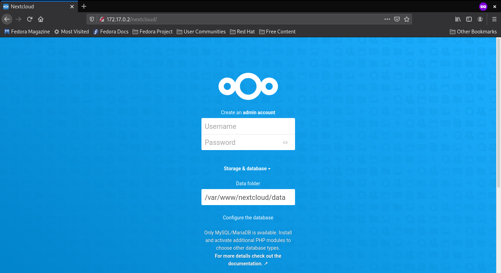 Imatge de l'inici on demana crear l'ususari administrador i on es guarden les dades

 Imatge de la configuració de la base de dades

 Al acabar aquest procès apreix el login on
s'introdueixen les dades de l'administrador, en aquest cas __ncadmin__ i ja
entrarem al __Dashboard__ de l'usuari, a partir d'aquí l'usuari pot accedir
als seus fitxers, a la configuració del servidor, a la botiga d'aplicacions, etc.

 Imatge del dashboard

# Versió 2 del servidor<span id="v2"/>
## Autoconfiguració i Onlyoffice

Un cop ens hem familiaritzat amb el funcionament del Nextcloud, podem estudiar de quina forma
es podria millorar el seu desplegament.

Un aspecte a destacar és la configuració manual que es realitza un cop instal·lat el Nextcloud. A la **Versió 1**,
s'ha de configurar manualment crear l'usuari administrador, la base de dades i el directori on es desen les dades.
Segons el manual de l'administrador:

> It is now possible to install Nextcloud entirely from the command line. This is convenient for scripted operations,
headless servers, and sysadmins who prefer the command line.

L'ordre que s'utilitza per fer la configuració via línia d'ordres és `occ`. El manual defineix la comanda de la següent forma:

> Nextcloud's occ command (origins from "ownCloud Console") is Nextcloud's command-line interface. You can perform many common server operations with occ, such as installing and upgrading Nextcloud, manage users, encryption, passwords, LDAP setting, and more.

> occ is in the nextcloud/ directory; for example /var/www/nextcloud on Ubuntu Linux. occ is a PHP script. You must run it as your HTTP user to ensure that the correct permissions are maintained on your Nextcloud files and directories.

Es remarca que s'ha d'executar com l'usuari del servei web, en el nostre cas, **www-data**. La comanda `occ` també permet instal·lar aplicacions
del Nextcloud, llavors podem aprofitar i fer un script amb la configuració del Nextcloud i l'aplicació que volíem provar, *Onlyoffice*. Aquest
script s'anomena *occ_apps.sh* i aquest és el seu contingut a la Versió 2:

```
/usr/bin/php /var/www/nextcloud/occ maintenance:install --database \
"mysql" --database-name "nextcloud" --database-user "ncadmin" --database-pass \
"XXXX" --admin-user "ncadmin" --admin-pass "XXXX"

/usr/bin/php /var/www/nextcloud/occ app:install onlyoffice
```
Repassem cadascuna de les parts del script. Al script tenim dues comandes a realitzar amb occ. Com l'executable es troba a
/var/www/nextcloud i s'ha d'executar amb php, posem les rutes absolutes. Després, 'maintenance:install' és l'ordre per realitzar la instalació
del servidor, i aquests són els seus arguments:

- `--database "mysql"`: Indica el tipus de base de dades.
- `--database-name "nextcloud"`: Aquest és el nom de la base de dades del Nextcloud.
- `--database-user "ncadmin"`: L`usuari administrador de la base de dades.
- `--database-pass "XXXX"`: La contrassenya de l'usuari administrador de la base de dades.
- `--admin-user "ncadmin"`: Usuari administrador del Nextcloud
- `--admin-pass "XXXX"`: Contrassenya de l'usuari administrador del Nextcloud

Un cop realitzada la instal·lació, ja podem realitzar comandes per afegir aplicacions. En aquest cas, utilitzarem l'ordre `app:install` per
obtenir l'*OnlyOffice*.

Aquest script l'executarem des de l'usuari del servei HTTP **www-data**. Per poder fer això, necessitarem ser administradors del servidor per poder executar comandes en el seu nom.
La comanda que tenim al *startup.sh* és la següent:

```
su www-data -s /bin/bash -c '/opt/docker/occ_apps.sh'
```

On `-s` indica la *shell* i `-c` la comanda.

Un cop acabada la instal·lació, ens mostrarà uns missatges per la sortida estàndard que indiquen que s'ha realitzat correctament:

```
Nextcloud was successfully installed
onlyoffice 7.0.0 installed
onlyoffice enabled
```

I només accedir a la direcció del servidor, ens demana iniciar sessió directament, i un cop dintre observem que tenim el *Onlyoffice*:


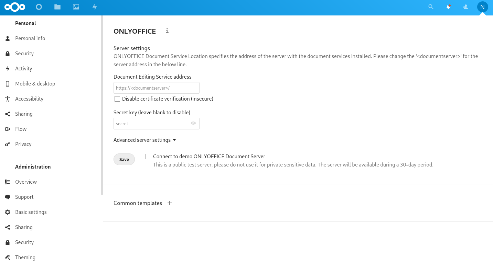

Com podem veure a la configuració, necessitem un Document Server. Segons el manual, el podem desplegar en un contenidor diferent,
assegurant que es pot comunicar amb el servidor. La comanda que ens proposen és aquesta:

```
sudo docker run -i -t -d -p 80:80 --restart=always onlyoffice/documentserver
```

Però a l'hora de provar-ho, no va donar molts bons resultats. Vam estar investigant per què no podíem encara així poder utilitzar el Document Server però no vam trobar una
solució vàlida. Llavors, vam intentar instal·lar el servidor des del llistat d'aplicacions del propi Nextcloud, així ja està integrat. Degut al pobre rendiment del contenidor, no
va ser possible una integració còmoda i versàtil. Vam decidir deixar la configuració del Document Server per més endavant.

Una altra modificació a la Versió 2, de menor rellevància, és l'addició de colors, missatges i línies de progrés a l'hora de desplegar el contenidor. Aquest és el seu aspecte:


Finalment, l'ordre per executar el contenidor, resultant amb una terminal al contenidor per millor administració del servidor, és:

```
# docker run --rm --name nextcloud -h nextcloud -p 80:80 -it andreupasalamar/nextcloud-server:v2
```
# Versió 3 del servidor<span id="v3"/>

## Configuració HTTPS i intent de Onlyoffice

Un cop automatitzada la instal·lació en la versió anterior ara toca començar a complir
amb les directives del projecte i el primer que fem és convertir el servidor en segur.

El primer a provar és generar uns certificats autosignats ja que és ràpid i senzill,
però això provoca un problema i és que el navegador no accepta certificats autosignats,
així que es busquen alternatives a internet i en aquest moment ens comencem a plantejar
si la instal·lació que hem fet ha estat la millor manera ja que la gran majoria de guies
o posts al forum de nextcloud tracten el tema de fer el servidor segur havent fet la
instal·lació a través de __Snapd__, una eina que no dominem, però pel que es veu als
forums és bastant utilitzada.

Decidim fer una petita prova de instal·lació per __Snapd__,
però no acabem d'entendre com funciona, ens falla i com ja tenim una instal·lació feta
i ens agrada com ha quedat doncs preferim seguir amb el que tenim i buscar solucions
corresponents a l'estil de configuració que tenim.

Continuem buscant i veiem que utilitzant l'aplicació __Certbot__ es poden generar
certificats només posant el nom del domini que li hem possat al sevidor, però perquè
l'aplicació __Certbot__ crei els certificats per al domini introduit cal que aquest
domini estigui registrat d'alguna manera i nosaltres no tenim el domini registrat ja
que el servidor està instal·lat per utilitzar-lo només en local.

Com l'opció d'utilitzar l'aplicació **Certbot** no ha estat exitosa, provem la idea del principi,
però aquesta vegada enlloc de generar certificats autosignats, l'autoritat certificadora no tindra res a
veure amb els certificats del servidor. Al provar això veiem que ja tenim accés via
https al servidor, però l'autoritat certificadora no està reconeguda pel navegador
s'ha d'importar el certificat seguint els següents passos:
</br></br></br>

1. Obrir el navegador i anar a la configuració.
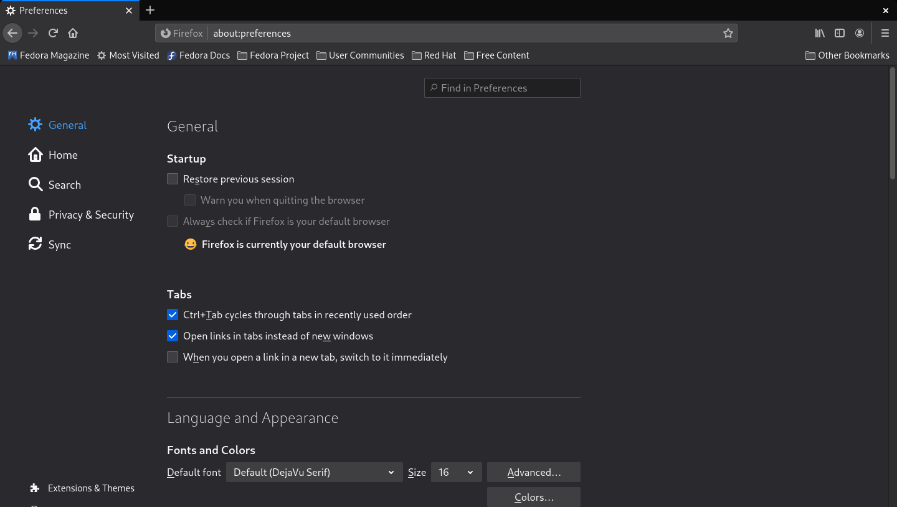
1. Accedir al apartat de privacitat i seguretat.

1. Baixar fins on diu certificats i donar-li a __Veure certificats__.

1. A l'apartat de autoritats, importar la CA.pem que ens permet que el navegador reconegui el certificat.

</br></br></br>

Per a poder accedir al servidor cal editar el fitxer nextcloud.conf per afegir la part
corresponent a l'activació SSL

~~~
  SSLEngine On
  SSLProtocol all -SSLv3
  SSLCertificateKeyFile /var/www/certs/serverkey.pem
  SSLCertificateFile /var/www/certs/server.pem
~~~
</br>

Respecte aquest fitxer també es canvien les línies corresponents a l'alias pel qual s'accedirà al servidor

~~~
  DocumentRoot /var/www/nextcloud/
  ServerName  www.edt.nextcloud.org
  serverAdmin cgrillo172@gmail.com
  serveralias edt.nextcloud.org
~~~

</br>

Al haver-li possat una URL com a alies al servidor, ara editar el fitxer */etc/hosts* ja
no és suficient i també cal editar un fitxer de dins del servidor anomenat *config.php*
on té un apartat anomenat *trusted_domains* que indica quins són els noms de domini que
reconeix i permet accedir al servidor.

Aquí està el fitxer config.php ubicat a */var/www/nextcloud/config/config.php*

~~~
<?php
$CONFIG = array (
  'passwordsalt' => 'WG8L1F23GOktRimygrdXwr4mhBiJL+',
  'secret' => 'DpkWcIG7arzbgOK98GGgkMjCHbGUF353hytE0rF9CVeJjcO0',
################################################################################
# Les següent línies són les que corresponen a quins dominis accepta el servidor
  'trusted_domains' => 
  array (
	  0 => 'localhost',
	  1 => 'www.edt.nextcloud.org',
  ),
################################################################################
  'datadirectory' => '/var/www/nextcloud/data',
  'dbtype' => 'mysql',
  'version' => '21.0.0.18',
  'overwrite.cli.url' => 'http://localhost',
  'dbname' => 'nextcloud',
  'dbhost' => 'localhost',
  'dbport' => '',
  'dbtableprefix' => 'oc_',
  'mysql.utf8mb4' => true,
  'dbuser' => 'ncadmin',
  'dbpassword' => 'jupiter',
  'installed' => true,
  'instanceid' => 'oczrw2ftq5am',
  'allow_local_remote_servers' => true,
);
~~~

Per automatitzar-ho tot, al startup.sh cal fer unes modificacions extres.

Creació del directori *certs* on aniran el certificats que permeten l'accés segur.

~~~
mkdir /var/www/certs
cp -r /opt/docker/server.pem /var/www/certs
cp -r /opt/docker/serverkey.pem /var/www/certs
~~~

Per assegurar-nos que s'entra al servidor Nextcloud i no a la pagina inicial d'apache
cal deshabilitar la configuració per defecte.

~~~
a2dissite 000-default.conf
~~~

L'últim pas del startup és afegir l'arxiu config.php al seu directori

~~~
cp /opt/docker/config.php /var/www/nextcloud/config/config.php
~~~

</br></br>

En aquesta versió l'última cosa que s'intenta és instaŀlar i configurar l'aplicació **Onlyoffice**, intentem
seguir una guia de la pagina del Onlyoffice  i el que intentem és executar el contenidor Docker que la propia
empresa té

~~~
docker run -i -t -d -p 80:80 --restart=always onlyoffice/documentserver
~~~

Al probar aquest contenidor seguint les indicacions de la guia no aconseguim que Nextcloud reconegui el document
server i sempre dona error. Per molt que busquem l'error a internet i provem solucions d'alguna gent que té
configuracions similars i per tant el problema pot derivar del mateix no aconseguim que funcioni. La següent
possibilitat d'instaŀlació que provem és la d'integrar l'aplicació dins el docker on està instaŀlat el servidor
i per fer-ho, se suposa que només fan falta 3 comandes.

Anar al directori d'aplicacions del Nextcloud

~~~
cd apps/
~~~

</br>

Baixar-se el repositori de Onlyoffice del git

~~~
git clone https://github.com/ONLYOFFICE/onlyoffice-nextcloud.git onlyoffice
~~~

Per acabar s'ha de canviar el propietari del directori a l'usuari d'apache

~~~
chown -R www-data:www-data onlyoffice
~~~

Suposadament havent seguit aquests passos hauria d'haver funcionat, però segueix sense establir-se la
connexió entre el servidor i el document server de tal manera que decidim desistir i deixar-ho correr pel
moment i tornar-ho a intentar més tard.

# Versió 4 del servidor<span id="v4"/>
## Solucions i millores

Un cop implementada la web segura, ara és hora de millorar problemes de memòria amb php
i el servidor integrat d'*Onlyoffice*  `documentserver_code`.

Els fitxers `apache_php.ini` i `cli_php.ini` son fitxers de configuració de PHP per Apache i
la shell interactiva. Els dos fitxers tenen dos linies de codi que ens interessa canviar. Aquestes linies són 
les següents:

```
post_max_size = 1G
memory_limit = 1G
```

- `post_max_size` estableix el límit máxim per les dades de l'operació POST. Aquest paràmetre hauria de ser menor
que `memory_limit`.

- `memory_limit` és el límit de memòria que *un* script de php pot consumir.

Els dos valors tenien per defecte 512MB i 8MB respectivament, i han sigut canviats a 1G un cop havent estudiat les condicions del servidor real. 
Això garantitza una comunicació molt més relaxada i millora l'experiència de l'usuari.

Un cop implementada aquesta modificació, es reinica el servidor d'apache:

```
service apache2 restart
```


El servidor de documents s'ha intentat implementar anteriorment, sense molt d'èxit, però l'addició de l'aplicació al llistat
és una prova després d'haver solucionat l'incidència amb PHP i també una preparació per a la futura Versió 5.

Gràcies al servidor de documents, *Onlyoffice* podrà treballar integradament amb Nextcloud i 
garantitzar que els usuaris puguin editar documents en linia.

# Versió 5 del servidor<span id="v5"/>
## Màquina real

S'implementa la configuració del contenidor de la Versió 4 a una màquina real per
comprovar i avaluar el funcionament del Nextcloud.

Ubuntu 20.04 LTS és la distribució elegida per Nextcloud a l'hora d'avaluar
la comunitat, l'estabilitat i la comoditat del sistema.

Primer de tot, vam seguir els passos de instal·lar un Ubuntu minimal sense repositoris
de tercers amb l'usuari local **guest**. Després d'instal·lar **vim** i **git**, vam seguir les comandes del Dockerfile
un cop havent clonat el repositori per tenir tots els paquets necessaris per al correcte funcionament del Nextcloud:

```
sudo apt upgrade && apt update
sudo apt -y install apt-utils aptitude vim wget nmap iproute2 less curl gpg apache2 mariadb-server pv
apt -y install libapache2-mod-php7.4 php7.4-gd php7.4-mysql php7.4-curl php7.4-mbstring php7.4-intl php7.4-gmp php7.4-bcmath php-imagick php7.4-xml php7.4-zip
```

Després, s'executen les ordres del 'startup.sh'. Es pot fer de dos formes:

- Copiar i enganxar les ordres del script.
- Executar el script.

Si volem executar el script, hauríem de copiar el contingut del repositori de la
Versió 4 a un nou directori `/opt/docker` i, sent aquest el directori actiu, executar el script
amb permisos d'administrador:

```
sudo chmod +x startup.sh
sudo ./startup.sh
```

Un cop finalitzat tot el procés, per comprovar el funcionament, necessitàvem un altre equip per actuar de client.
Ja que la publicació del servidor està limitada a la xarxa local, en aquest cas, l'aula N2I, els equips elegits són l'i16 i l'i18, equips de l'Andreu i del Carles respectivament.

Abans ens hem d'assegurar d'haver importat el certificat d'autoritat pertinent al sistema i al Navegador. Per importar el certificat al sistema, ens l'hem de
copiar a `etc/pki/ca-trust/source/anchors/` i executar `update-ca-trust`, tal com diu el **README** dintre del directori `etc/pki/ca-trust/source/`:

```t
This directory /etc/pki/ca-trust/source/ contains CA certificates and
trust settings in the PEM file format. The trust settings found here will be
interpreted with a high priority - higher than the ones found in
/usr/share/pki/ca-trust-source/.

=============================================================================
QUICK HELP: To add a certificate in the simple PEM or DER file formats to the
list of CAs trusted on the system:

Copy it to the
/etc/pki/ca-trust/source/anchors/
subdirectory, and run the
update-ca-trust
command.

If your certificate is in the extended BEGIN TRUSTED file format,
then place it into the main source/ directory instead.
=============================================================================

Please refer to the update-ca-trust(8) manual page for additional information.

```

Cal destacar que només hi ha un usuari administrador, però més d'un usuari pot estar amb sessió iniciada a l'administrador.
Això és un aspecte positiu ja que en cas d'aplicació en entorn real, la resolució d'incidències i les tasques administratives es poden
realitzar de forma simultània.

Un cop es pot garantir l'accés al servidor, donem per conclosa la prova amb resultat d'èxit. La creació i edició de documents
amb els aplicatius *Collabora* i *Onlyoffice* també va ser possible.

Per millorar l'experiència dels usuaris, es va afegir l'aplicació **Talk** per permetre la comunicació entre els usuaris del servidor.
Talk incorpora missatgeria instantània, transferència d'arxius i trucades.

Després, es va incorporar l'usuari local de prova **Mati** sense permisos d'administrador per fer una segona prova.
Mati va ser capaç de crear, editar, compartir i eliminar un full de càlcul, un document de text i una presentació amb les dos aplicacions.

La tercera prova implicava iniciar sessió amb un usuari sense permisos d'administrador per poder iniciar sessió via preferències del sistema, comptes en línia:
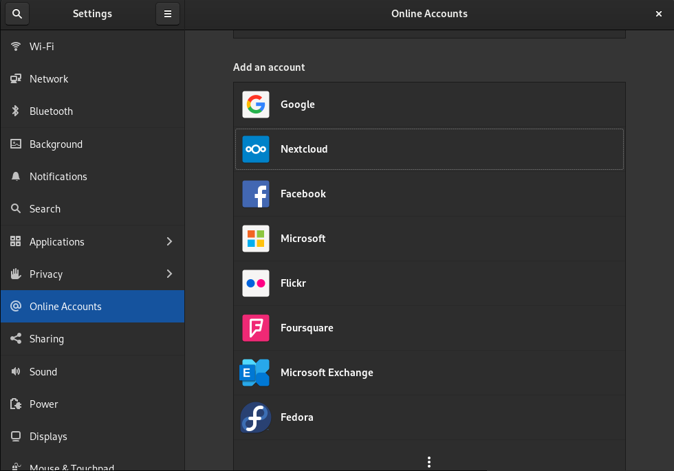
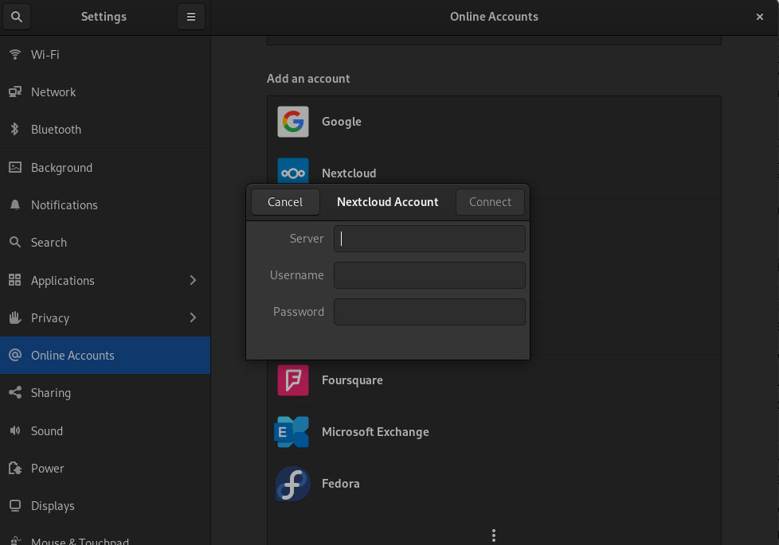

Haurem d'indicar el servidor (https://www.edt.nextcloud.org), l'usuari i la contrasenya.

Quan s'hagi iniciat sessió, ens demanarà què volem sincronitzar. Tenim tres funcionalitats que es poden sincronitzar entre
el servidor de Nextcloud i el sistema:

- Contactes: Els contactes del Nextcloud apareixeran a l'aplicació del GNOME *Contacts*.
- Calendari: Els events del calendari seran sincronitzats amb *Calendar*.
- Arxius: El Nautilus crearà un nou accés per poder accedir al nostre "*home*" del Nextcloud. També es mostrarà i s'actualitzaran les carpetes
que s'han sincronitzat amb el compte.

# Autenticació d'usuaris per ldap<span id="authldap"/>

## Container de ldap simulant una classe

Un cop el servidor ja ens ha funcionat i amb les aplicacions requerides operatives al 100%,
decidim aplicar un mètode d'autenticació que vagi més enllà del que ofereix Nextcloud.

Ja que aquest curs hem aprés a utilitzar ldap, aprofitem els coneiexments obtinguts per implementar
al servidor Nextcloud el sistema d'autenticació per ldap creant nosaltres mateixos un container amb una base de
dades propia. La nostra idea és simular una classe i els seus professors, en total seran 10 alumnes i 5 professors.

El primer de tot és crear el Dockefile on s'insta·larà ldap

Contingut del fitxer

~~~
FROM fedora:27
RUN dnf -y install procps openldap-clients openldap-servers
RUN mkdir /opt/docker
COPY * /opt/docker/
RUN chmod +x /opt/docker/install.sh /opt/docker/startup.sh
WORKDIR /opt/docker
EXPOSE 389
CMD ["/opt/docker/startup.sh"]
~~~

</br></br>

Amb això ja ens podem possar a configurar la base de dades que tindra una base que permetrà reconeixer que és per
al servidor de Nxetcloud.

Contingut del fitxer **ldap.conf**

~~~
# LDAP Defaults
#

# See ldap.conf(5) for details
# This file should be world readable but not world writable.

BASE	dc=edt,dc=nextcloud,dc=org
URI	ldap://localhost

#SIZELIMIT	12
#TIMELIMIT	15
#DEREF		never

#TLS_CACERTDIR /etc/openldap/certs
TLS_CACERT /opt/docker/CA.pem

# Turning this off breaks GSSAPI used with krb5 when rdns = false
SASL_NOCANON	on
~~~

</br></br>

El següent pas serà crear els certificats que faran que la base de dades ldap sigui segura, aquesta vegada,
a diferència del que passa amb el VirtualHost de Nextcloud, els certificats poden ser autosignats ja que ningú els
ha de verificar. Un fitxer molt important a la hora de fer els cerificats del servidor és el de les extensions
que serà el que indicarà com es podrà establir connexió amb la base de dades.

Contingut del fitxer ext.alternate.conf

~~~
basicConstraints=CA:FALSE
extendedKeyUsage=serverAuth
subjectAltName=IP:172.17.0.2,IP:127.0.0.1,email:copy,URI:ldaps://ldap.edt.org
~~~

</br></br>

Un cop es tenen els certificats cal configurar TLS, la *database config*, la *database mdb* i la *database monitor*

Contingut del fitxer slapd.conf

~~~
# See slapd.conf(5) for details on configuration options.
# This file should NOT be world readable.
#

#include	/etc/openldap/schema/corba.schema
include		/etc/openldap/schema/core.schema
include		/etc/openldap/schema/cosine.schema
#include	/etc/openldap/schema/duaconf.schema
#include	/etc/openldap/schema/dyngroup.schema
include		/etc/openldap/schema/inetorgperson.schema
#include	/etc/openldap/schema/java.schema
#include	/etc/openldap/schema/misc.schema
include		/etc/openldap/schema/nis.schema
include		/etc/openldap/schema/openldap.schema
#include	/etc/openldap/schema/ppolicy.schema
include		/etc/openldap/schema/collective.schema

# Allow LDAPv2 client connections.  This is NOT the default.
allow bind_v2
pidfile		/var/run/openldap/slapd.pid
TLSCACertificateFile        /etc/openldap/certs/CA.pem
TLSCertificateFile          /etc/openldap/certs/server.pem
TLSCertificateKeyFile       /etc/openldap/certs/serverkey.pem
TLSVerifyClient       never
TLSCipherSuite        HIGH:MEDIUM:LOW:+SSLv2
#argsfile	/var/run/openldap/slapd.args

#-------------------------------------------------
database config
rootdn "cn=Sysadmin,cn=config"
rootpw {SSHA}JGzCfrm+TvKfHtbpjPdz3YCVYpqUbTVY
#passwd syskey
# -------------------------------------------------
database mdb
suffix "dc=edt,dc=nextcloud,dc=org"
rootdn "cn=Manager,dc=edt,dc=nextcloud,dc=org"
rootpw secret
directory /var/lib/ldap
index objectClass eq,pres
access to * by self write by * read
# ----------------------------------------------------------------------
database monitor
access to * by * none
~~~

</br></br>

Ara que ja tenim les configuracions preparades cal crear les dades que s'insertaran, tant l'arrel,
com les organitzacions, com els grups i els usuaris. Tot això s'especifica junt en un fitxer anomenat nc.ldif


El fragment següent correspon a la part on s'especifica l'arrel i les *Organitzational Units*

~~~
# -----------------------------------------------

dn: dc=edt,dc=nextcloud,dc=org
dc: edt
description: Base de dades LDAP dels membres de Nextcloud
objectClass: dcObject
objectClass: organization
o: edt.nextcloud.org

dn: ou=users,dc=edt,dc=nextcloud,dc=org
ou: users
description: Usuaris de Nextcloud
objectclass: organizationalunit

dn: ou=groups,dc=edt,dc=nextcloud,dc=org
ou: groups
description: Grups del Nextcloud
objectclass: organizationalunit

# -----------------------------------------------
~~~

</br></br>

En aquesta següent part s'indiquen els usuaris que després s'especificaran com a usuaris del grup de professors.

~~~
# ---------- Professors --------------------------
dn: uid=eduard,ou=users,dc=edt,dc=nextcloud,dc=org
objectclass: posixAccount
objectclass: inetOrgPerson
cn: Eduard
sn: Canet
ou: users
uid: eduard
uidNumber: 5201
gidNumber: 602
homeDirectory: /tmp/home/eduard
userPassword: {SSHA}4Dw7GeOzkjqAt92EGghrOeiDGoPZRBOs

dn: uid=maribel,ou=users,dc=edt,dc=nextcloud,dc=org
objectclass: posixAccount
objectclass: inetOrgPerson
cn: Maribel
sn: Espada
ou: users
uid: maribel
uidNumber: 5202
gidNumber: 602
homeDirectory: /tmp/home/maribel
userPassword: {SSHA}RQAO5W9gKmbHVG9INBjmnZcVPib0YnWu

dn: uid=ainhoa,ou=users,dc=edt,dc=nextcloud,dc=org
objectclass: posixAccount
objectclass: inetOrgPerson
cn: Ainhoa
sn: Zaldua
ou: users
uid: ainhoa
uidNumber: 5203
gidNumber: 602
homeDirectory: /tmp/home/ainhoa
userPassword: {SSHA}+gs+3K1eT9R7sUt+HnXDyuVVPlJlf9h6

dn: uid=montse,ou=users,dc=edt,dc=nextcloud,dc=org
objectclass: posixAccount
objectclass: inetOrgPerson
cn: Montse
sn: Soler
ou: users
uid: montse
uidNumber: 5204
gidNumber: 602
homeDirectory: /tmp/home/montse
userPassword: {SSHA}gegM+PafbuCg+Zg0G1wq+wU58uLaJSBB

dn: uid=victor,ou=users,dc=edt,dc=nextcloud,dc=org
objectclass: posixAccount
objectclass: inetOrgPerson
cn: Victor
sn: Hernandez
ou: users
uid: victor
uidNumber: 5205
gidNumber: 602
homeDirectory: /tmp/home/victor
userPassword: {SSHA}IHkEimROQSVjgXkp6RHIe+bqxw3z4Qdq

# ------------------------------------------------
~~~

</br></br>

El proper fragment de codi correspon als usuaris que després s'especificaran com a usuaris del grup d'alumnes.

~~~
# --------- Alumnes --------------------------------

dn: uid=mark,ou=users,dc=edt,dc=nextcloud,dc=org
objectclass: posixAccount
objectclass: inetOrgPerson
cn: Mark
sn: Santiago
ou: users
uid: mark
uidNumber: 5001
gidNumber: 601
homeDirectory: /tmp/home/mark
userPassword: {SSHA}AHDGtAyvB+m08nfzgCXXCpT7Wj5Xl/bc

dn: uid=diego,ou=users,dc=edt,dc=nextcloud,dc=org
objectclass: posixAccount
objectclass: inetOrgPerson
cn: Diego
sn: Sanchez
ou: users
uid: diego
uidNumber: 5002
gidNumber: 601
homeDirectory: /tmp/home/diego
userPassword: {SSHA}7sdVmGM9IJPHXrlTuB1XTNZFTKhn4CY/

dn: uid=christian,ou=users,dc=edt,dc=nextcloud,dc=org
objectclass: posixAccount
objectclass: inetOrgPerson
cn: Christian
sn: Manalo
ou: users
uid: christian
uidNumber: 5003
gidNumber: 601
homeDirectory: /tmp/home/christian
userPassword: {SSHA}miStgAV1YPGIoPm62pJV//qlv/vbtGVR

dn: uid=javier,ou=users,dc=edt,dc=nextcloud,dc=org
objectclass: posixAccount
objectclass: inetOrgPerson
cn: Javier
sn: Moyano
ou: users
uid: javier
uidNumber: 5004
gidNumber: 601
homeDirectory: /tmp/home/javier
userPassword: {SSHA}wmNL/oBT0SjziTg64seJbuHI8CqB+WnW


dn: uid=roberto,ou=users,dc=edt,dc=nextcloud,dc=org
objectclass: posixAccount
objectclass: inetOrgPerson
cn: Roberto
sn: Martinez
ou: users
uid: roberto
uidNumber: 5005
gidNumber: 601
homeDirectory: /tmp/home/roberto
userPassword: {SSHA}nq/PDuYqveb5zqe9M+wxIpy3Tedq1mnC

dn: uid=alejandro,ou=users,dc=edt,dc=nextcloud,dc=org
objectclass: posixAccount
objectclass: inetOrgPerson
cn: Alejandro
sn: Lopez
ou: users
uid: alejandro
uidNumber: 5006
gidNumber: 601
homeDirectory: /tmp/home/alejandro
userPassword: {SSHA}5HhVaTCHRPjH5E0TMmaU1/bBLlmChBg/

dn: uid=mati,ou=users,dc=edt,dc=nextcloud,dc=org
objectclass: posixAccount
objectclass: inetOrgPerson
cn: Mati
sn: Vizcaino
ou: users
uid: mati
uidNumber: 5007
gidNumber: 601
homeDirectory: /tmp/home/mati
userPassword: {SSHA}sUaeGYrBYFHin1ZdJRLGYpZdZLfNKglt

dn: uid=carles,ou=users,dc=edt,dc=nextcloud,dc=org
objectclass: posixAccount
objectclass: inetOrgPerson
cn: Carles
sn: Grillo
ou: users
uid: carles
uidNumber: 5008
gidNumber: 601
homeDirectory: /tmp/home/carles
userPassword: {SSHA}QMQBiKbthdyXddg6Jiw4aTCPW3/aynt0 

dn: uid=andreu,ou=users,dc=edt,dc=nextcloud,dc=org
objectclass: posixAccount
objectclass: inetOrgPerson
cn: Andreu
sn: Pasalamar
ou: users
uid: andreu
uidNumber: 5009
gidNumber: 601
homeDirectory: /tmp/home/andreu
userPassword: {SSHA}AGc/MSO6J3CD6jPXW3j7sg5QGfhTUhvg

dn: uid=hicham,ou=users,dc=edt,dc=nextcloud,dc=org
objectclass: posixAccount
objectclass: inetOrgPerson
cn: Hicham
sn: Varo
ou: users
uid: hicham
uidNumber: 5010
gidNumber: 601
homeDirectory: /tmp/home/hicham
userPassword: {SSHA}dWyBQOcXoVNOkbWA6T5PiW7iPV7h3RJf


# --------------------------------------------------
~~~

</br></br>

La ultima part del fitxer és en la que es declaren els grups i quins usuaris pertanyen a cada un d'aquest grups.

~~~
# ---------- Grups ------------------------------

dn: cn=admin,ou=groups,dc=edt,dc=nextcloud,dc=org
cn: admin
gidNumber: 600
description: Grup d'administradors
memberUid: carles
memberUid: andreu
objectclass: posixGroup

dn: cn=students,ou=groups,dc=edt,dc=nextcloud,dc=org
cn: students
gidNumber: 601
description: Grup d'alumnes
memberUid: mark
memberUid: christian
memberUid: diego
memberUid: javier
memberUid: roberto
memberUid: alejandro
memberUid: mati
memberUid: carles
memberUid: andreu
memberUid: hicham
objectclass: posixGroup

dn: cn=teachers,ou=groups,dc=edt,dc=nextcloud,dc=org
cn: teachers
gidNumber: 602
description: Grup de professors
memberUid: eduard
memberUid: maribel
memberUid: ainhoa
memberUid: montse
memberUid: victor
objectclass: posixGroup

# -----------------------------------------------
~~~

</br><br>

Per acabar amb la configuració del contenidor ldaps ja només cal el fitxer install.sh on es fa la copia dels fitxers
al directori corresponent i s'implementa la configuració de la base de dades i els usuaris.

Contingut del fitxer install.sh

~~~
cp  /opt/docker/ldap.conf /etc/openldap/ldap.conf
mkdir /etc/openldap/certs
cp /opt/docker/CA.pem /etc/openldap/certs/.
cp /opt/docker/server.pem /etc/openldap/certs/.
cp /opt/docker/serverkey.pem  /etc/openldap/certs/.

rm -rf /etc/openldap/slapd.d/*
rm -rf /var/lib/ldap/*
cp /opt/docker/DB_CONFIG /var/lib/ldap
slaptest -F /etc/openldap/slapd.d -f /opt/docker/slapd.conf
slapadd -F /etc/openldap/slapd.d -l /opt/docker/nc.ldif
chown -R ldap.ldap /etc/openldap/slapd.d
chown -R ldap.ldap /var/lib/ldap
~~~

</br></br></br></br>

***

## Configuració a Nextcloud per comunicar-se amb el contenidor ldap

El primer que s'ha de fer és instalar el modul php de ldpa i reiniciar el servei apache

~~~
apt install php-ldap

service apache2 reload
~~~

Després d'això cal anar al servidor i activar l'aplicació ***LDAP user and group backend*** i anar a la configuració de l'aplicació per
configurar el servidor.

</br></br>


La primera pàgina és on s'especifica el *Host*, el *Port*, el *User DN* i la seva contrasenya, i finalment el *Base DN*.

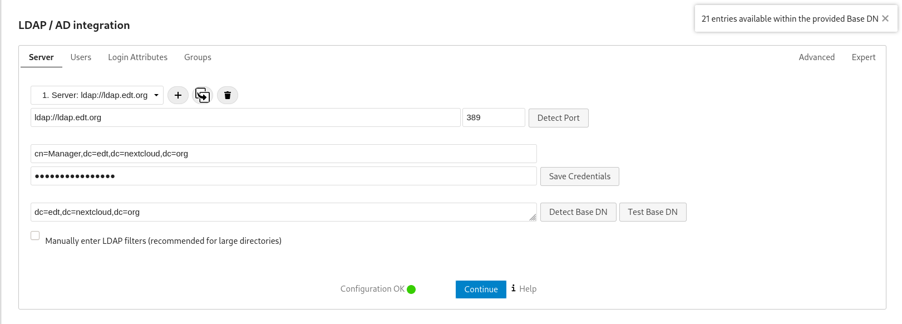

</br></br>

En la següent pestanya, la dels usuaris, cal especificar quins són els *ObjectClass* que buscarà.

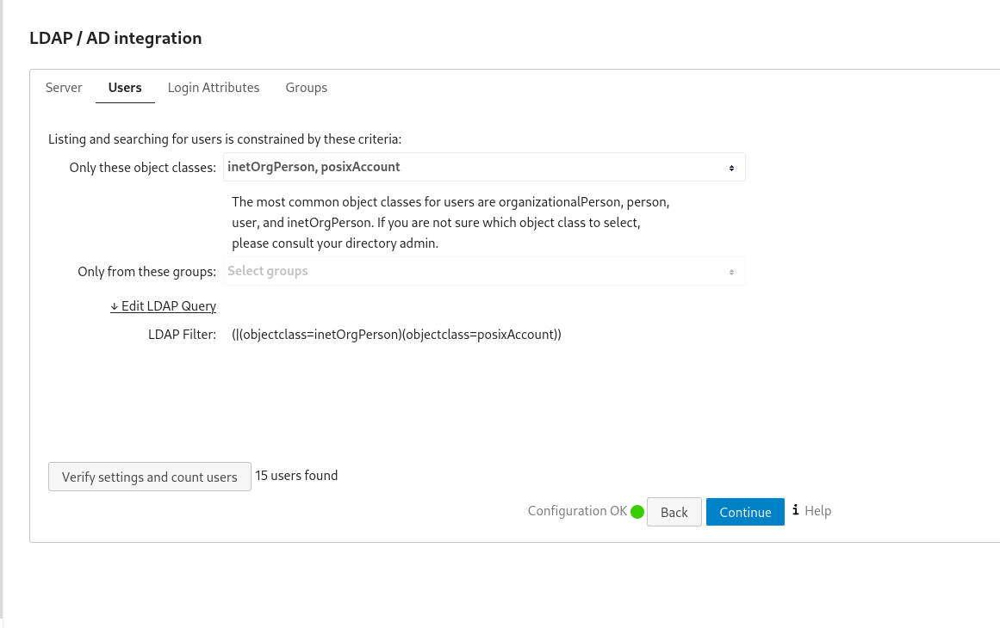

</br></br>

A la tercera pestanya es configuren els atributs de *Login*, els basics que t'ofereix Nextcloud són *LDAP / AD Username* i *LDAP / AD Email Address*, tot i que et permet escollir altres atributs que hagis donat als usuaris.

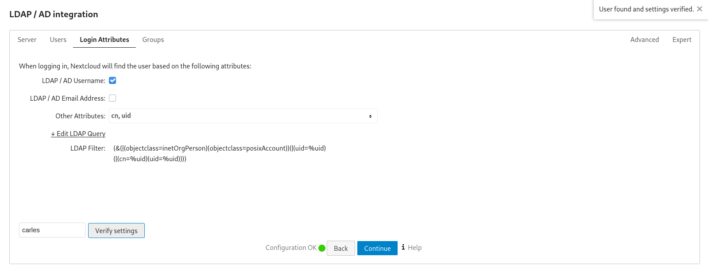

</br></br>

En la última pestanya de configuració demana que s'especifiqui quins seran els grups que afegirà a la llista d'usuaris.

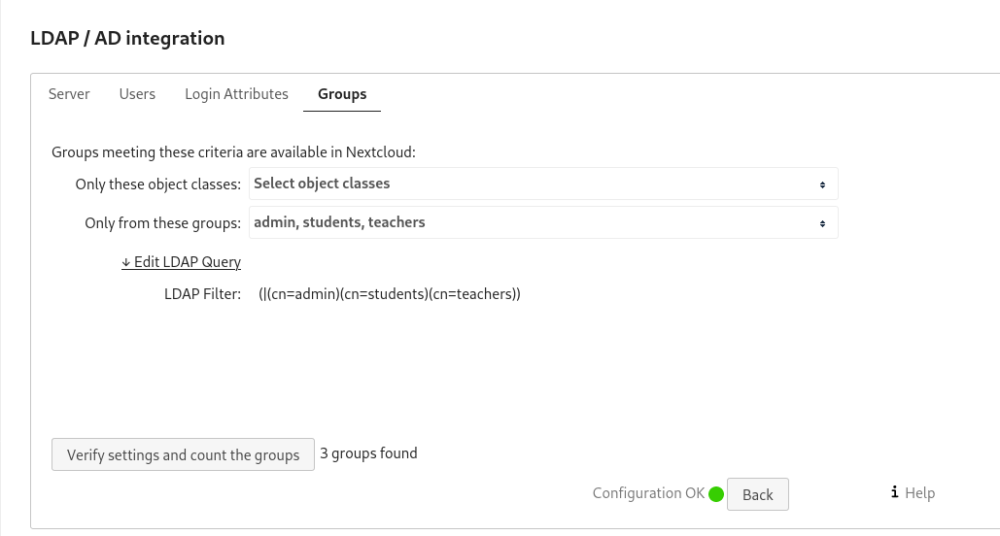

</br></br></br>

Un cop feta la configuració, si s'accedeix a la llista d'usuaris es pot observar com ara ja apareixen tots i els grups corrresponents.


</br></br>

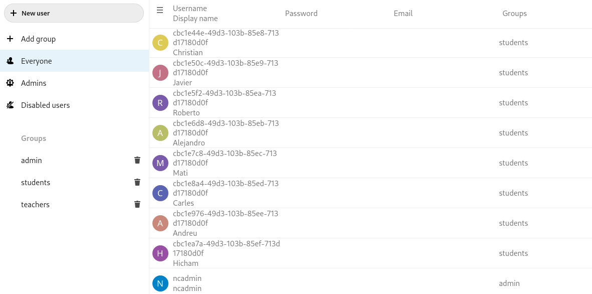

# Treball col·laboratiu en línia: comparació de Google Docs amb Collabora i OnlyOffice<span id="comp"/>

</br></br>

## Diferents tipus de documents: Text, Fulls de càlcul,Presentacions. Altres(si n’hi ha)

Tant *OnlyOffice* com *Collabora* ofereixen crear documents de text, presentacions i fulls de càclul, no permeten crear cap tipus de fitxer més mentre que *Google Docs* a part d'aquests, també ofereix crear formularis.

 Imatge on es veuen els arxius que es poden crear amb l'aplicació OnlyOffice

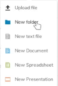 Imatge on es veuen els arxius que es poden crear amb l'aplicació Collabora

 Imatge on es veuen els arxius que es poden crear amb Google Docs

</br></br>

Si és cert que Google dona més varietat de documents, però una cosa en la que Google no falla una mica és en els formats d'aquests arxius. Mentre les aplicacions de Nextcloud a la hora de guardar els fitxers et permeten escollir el format i l'extensió amb que es queda guardat, Google l'únic que permet és descarregar-se el fitxer en un altre format, però si el vols tenir guardat, per possar un exemple, en format *.pdf*, t'has de descarregar el fitxer en aquest format i després pujar-lo al núvol.

 Imatge on es pot veure que Google Docs no permet guardar en un altre format, només descarregar.

</br></br></br></br>

## Control de versions d’arxius o històric de versions

En aquest aspecte, totes les aplicacions a comparar són exceŀlents, permeten veure el historial amb data, hora i quins usuaris han estat els que han fet els canvis permetent tornar a les versions anteriors o fent una copia de la versió que es vulgui per així poder tenir guardades varies versions si es necessita.

</br></br></br></br>

## Possibilitat d’edició simultània

Tant les aplicacions instaŀlades a Nextcloud com Google Docs permeten editar simultaniament entre diversos usuaris, en aquest cas que el servidor Nextcloud està instaŀlat en local, l'edició simultania va millor o pitjor en funció de com potent sigui l'ordinador on està instaŀlat. Per tant comparar el nostre humil servidor amb Google és una comparació poc útil, però si el servidor Nextcloud s'instaŀlés en un servidor potent, la diferencia seria mínima.


</br></br></br></br>

## Control d’accés: (visualització, edició) × (usuarisautenticats, usuarisanònims)

En quant al control d'accés, Nextcloud i Google permeten escollir quins permisos tenen els usuaris al accedir al document, només per veure'l o també per editar-lo. Google a més d'això també permet decidir si els usuaris amb qui has compartit el document el pot compartir també.

 Imatge on es poden veure els permisos que permet donar Nextcloud

Les opccions que donen tant Google com Nextcloud respecte a qui compartir és molt amplia, mentre que Google resulta molt fàcil compartir tant amb usuaris autenticats com usuaris anonims, per compartir amb registrats només s'ha d'indicar el correu dels usuaris, i per usuaris no autenticats l'unic que s'ha de fer és indicar que el link sigui públic i ja està. En canvi a Nextcloud com són servidors privats per poder compartir ja sigui a usuaris autenticats o anònims, cal que tinguin accés al servidor, com en el nostre cas el servidor és local, per molt que es tingui un link, no es podrà accedir al fitxer des de fora de la xarxa del servidor.


# Comparar funcionalitats respecte Google Suite pel que fa a: <span id="sync"/>

Google i Nextcloud pel que fa a la sincronització, són molt similars, permeten sincronitzar tot l'arbre de directoris que es tingui al servidor, els diversos calendaris que es puguin tenir, tant compartits (indiferentment si tu ets l'usuari que els ha creat o no) com personals, i també la llista de contactes.

</br></br>

En la següent imatge es pot veure el procés per connectar amb el servidor de Nextcloud, com en el nostre cas és local i té uns certificats autosignats, perquè el sistema reconegui la URL com a segura caldra afegir l'Autoritat Certificadora al sistema.

~~~
[root@localhost projecte-nextcloud]# cp newcerts/CA.pem /etc/pki/ca-trust/source/anchors/
[root@localhost projecte-nextcloud]# update-ca-trust
~~~

Un cop afegit el certificat la URL és reconeguda correctament i ja només cal introduir el *Username* i la *Password*


</br></br>

Un cop connecta amb el servidor, Fedora pregunta quines coses vols sincronitzar i les opcions són: calendari, contactes i fitxers.

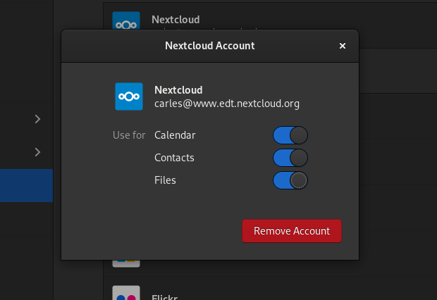

</br></br>

Igual que es fa per connectar amb el servidor de Nextcloud, es fa també per connectar-se amb Google, però aquí és més senzill perquè només cal iniciar sessió amb el compte de Gmail i ja és suficient.

En la següent imatge es pot observar com Google et permet a més del que ofereix Nextcloud sincronitzar el correu, les fotos i les impresores associades al teu compte.


</br></br></br></br>

## Sincronització d’arxius (Google Drive)

Pel que fa a la sincronització d'arxius, que en el cas de Google seria els arxius i directoris de Google Drive, funcionen sense cap diferencia aparent, tots dos et donen accés als fitxers que tens al servidor i els canvis que es facin es veuran reflexats inmediatament al servidor.

Un cop introduits els dos comptes al sistema, quan s'obre el Nautilus es pot veure que apareixen els dos servidors com a accessibles, el de Google i el de Nextcloud.

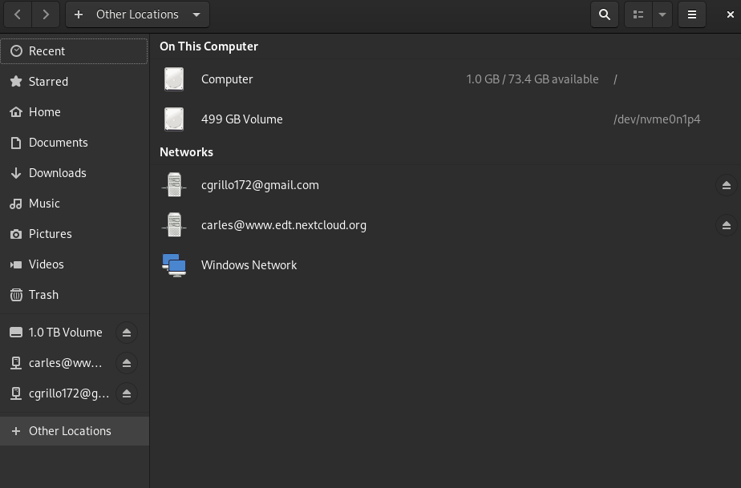

</br></br>

En la següent imagte es pot observar que estant dins del directori de Nextcloud creat a l'ordinador estan tots els fitxers i directoris que hi han al servidor.


</br></br>

Igual amb la foto anterior, es veu que apareix el directori corresponent al drive del compte introduit amb tots els fitxers i directoris que s'hagin pujat per l'usuari, tot allò que sigui compartit però no creat per ell, no apareixe.

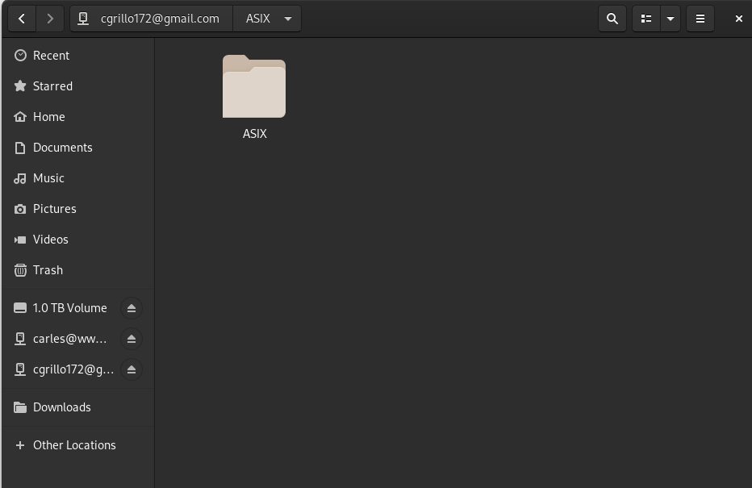

</br></br></br></br>

## Sincronització de calendaris

La sincronització de calendaris funciona igual tant en Nextcloud com en Google Calendar, tots els calendaris, propis o compartits amb tu són visibles i es poden realitzar canvis que després es veuen reflectits a les aplicacions.

A contiuació imatges de sincronització dels calendaris de Nextcloud.

En aquesta imatge es pot veure com l'usuari ***carles*** pot crear i editar un calendari que li ha compartit l'usuari ***ncadmin***

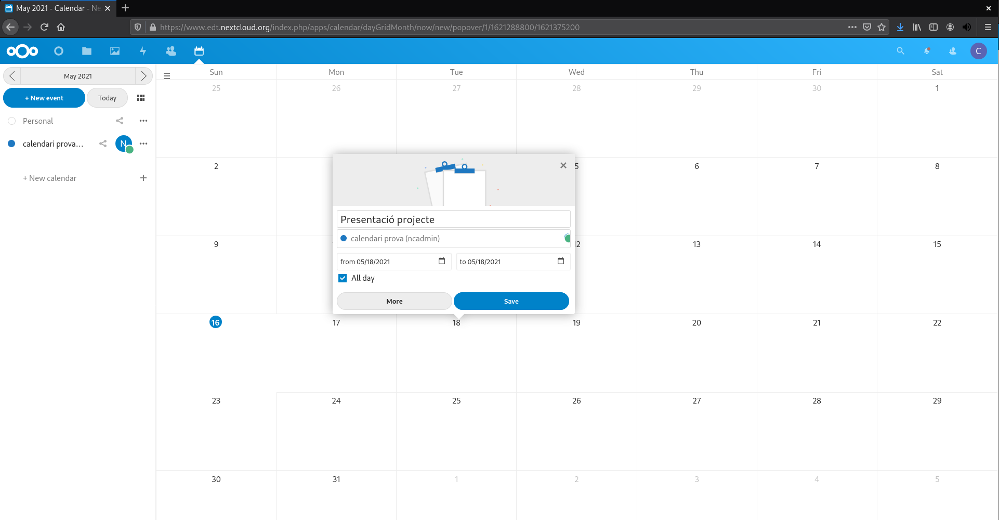

</br>

En aquesta imatge s'observa com en un calendari compartit els canvis efectuats per un usuari són visualitzats sense problema pels altres usuaris.

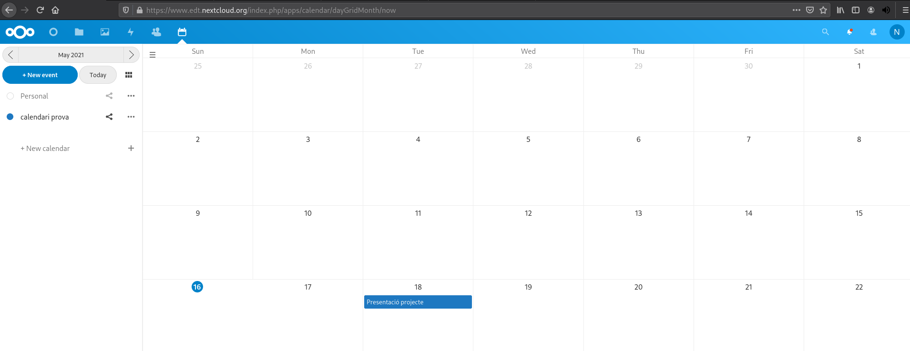

</br>

En la següent imatge es veu a l'aplicació *Calendar* del Fedora que els esdevenimets del calendari de Nextcloud són visibles al sistema.

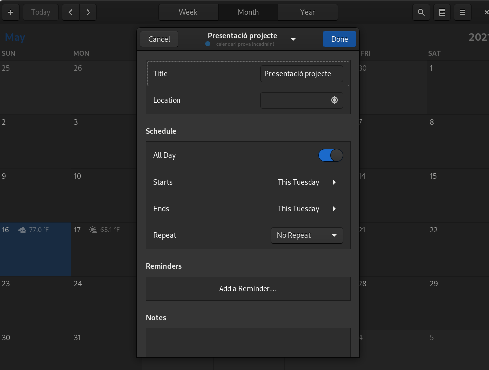

</br>

Ara si provem amb Google veiem que funciona exactament igual, els esdeveniments creats a *Google Calendar* es veuran reflectits a l'aplicació *Calendar* del sistema


</br></br></br></br>

## Sincronització de contactes

Pel que fa als contactes, Nextcloud resulta una mica extrany mentre que Google et mostra aquells contactes del telèfon que tinguis guardats al núvol de Google i també de la gent amb qui has intercanviat correus, però Nextcloud tot i que també et mostra els contactes de la gent del servidor amb qui has intercanviat missatges, també permet afegir-ne de nous, cosa que no sembla gaire necessària ja que al no poder fer trucades telefòniques no té gaire sentit tenir contactes de fora del servidor, només en cas de ser un usuari que està connectat a Nextcloud tot el dia i vol tenir l'agenda de contactes al servidor simplement per comoditat.

A continuació una imatge de l'aplicació de contactes del sistema on es veuen els contactes amb els que s'ha interactuat.

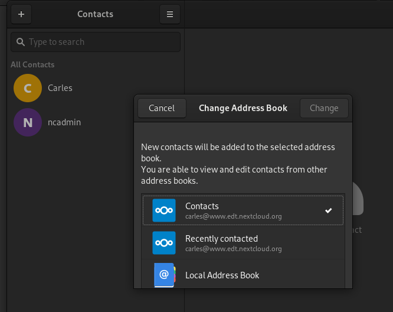


# Conclusió<span id="end"/>
## Un projecte amb futur

Hem arribat ja al final de la documentació del projecte.
Ha sigut un trajecte curt però intents, amb una corba d'aprenentatge positiva.
Gràcies a la comunitat i a la documentació en línia, hem pogut acomplir aquest projecte
partint de coneixements nuls d'aquest camp de la informàtica.

Pensem que una teòrica aplicació del Nextcloud a l'Escola del Treball
podria resultar amb:

- Compartició de fitxers més efectiva
- Comunicació directa Alumne - Professor
- Edició de documents, realització de fulls de càlcul i elaboració
de presentacions sense aplicacions d'escriptori.
- Aplicatius d'aprenentatge

També pot tenir un impacte positiu quant a atracció de la informàtica
per alumnes de nova incorporació. La comparativa senzillesa - funcionalitats garanteix una
experiència bona.

A més, s'afegiria una nova contribució al codi obert molt rellevant i
significativa.

*Carles Grilló Oller*

*Andreu Pasalamar Carbó*

*2HISIX, Administració de Sistemes Informàtics en Xarxa, Escola del Treball, Curs 2020-2021*