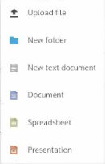
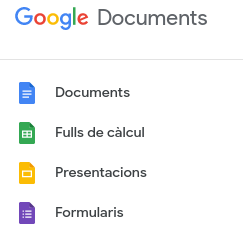
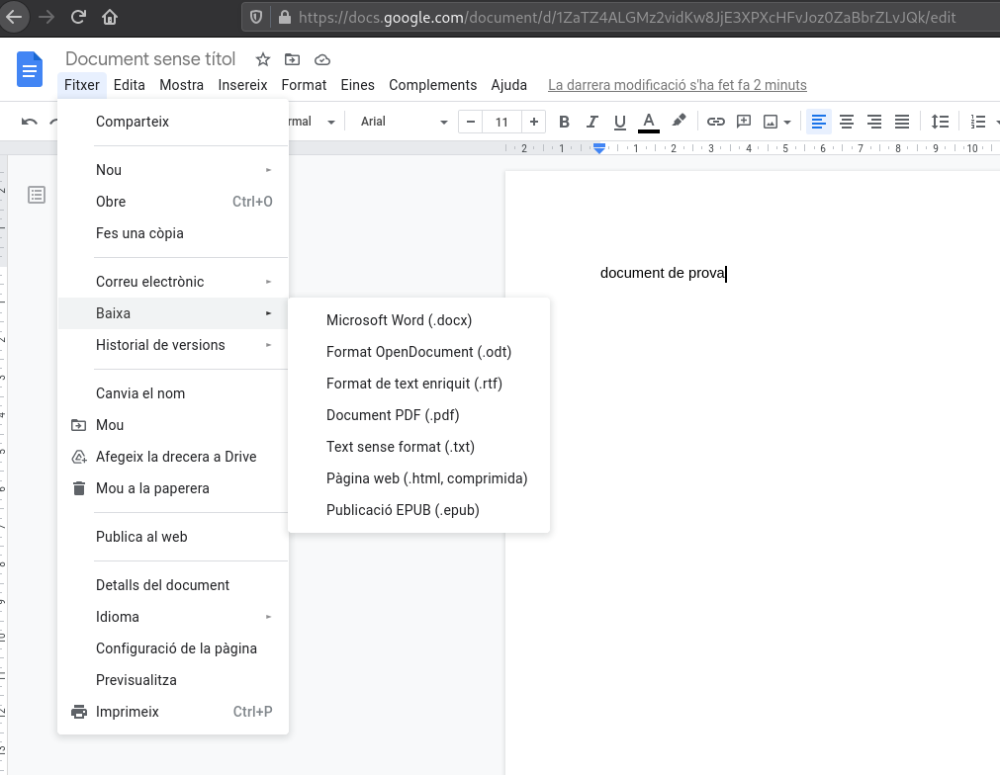

# Treball col·laboratiu en línia: comparació de Google Docs amb Collabora i OnlyOffice

  

## Diferents tipus de documents: Text, Fulls de càlcul,Presentacions. Altres(si n’hi ha)

Tant *OnlyOffice* com *Collabora* ofereixen crear documents de text, presentacions i fulls de càclul, no permeten crear cap tipus de fitxer més mentre que *Google Docs* a part d'aquests, també ofereix crear formularis.

 Imatge on es veuen els arxius que es poden crear amb l'aplicació OnlyOffice

 Imatge on es veuen els arxius que es poden crear amb l'aplicació Collabora

 Imatge on es veuen els arxius que es poden crear amb Google Docs

  

Si és cert que Google dona més varietat de documents, però una cosa en la que Google no falla una mica és en els formats d'aquests arxius. Mentre les aplicacions de Nextcloud a la hora de guardar els fitxers et permeten escollir el format i l'extensió amb que es queda guardat, Google l'únic que permet és descarregar-se el fitxer en un altre format, però si el vols tenir guardat, per possar un exemple, en format *.pdf*, t'has de descarregar el fitxer en aquest format i després pujar-lo al núvol.

 Imatge on es pot veure que Google Docs no permet guardar en un altre format, només descarregar.

    

## Control de versions d’arxius o històric de versions

En aquest aspecte, totes les aplicacions a comparar són exceŀlents, permeten veure el historial amb data, hora i quins usuaris han estat els que han fet els canvis permetent tornar a les versions anteriors o fent una copia de la versió que es vulgui per així poder tenir guardades varies versions si es necessita.

    

## Possibilitat d’edició simultània

Tant les aplicacions instaŀlades a Nextcloud com Google Docs permeten editar simultaniament entre diversos usuaris, en aquest cas que el servidor Nextcloud està instaŀlat en local, l'edició simultania va millor o pitjor en funció de com potent sigui l'ordinador on està instaŀlat. Per tant comparar el nostre humil servidor amb Google és una comparació poc útil, però si el servidor Nextcloud s'instaŀlés en un servidor potent, la diferencia seria mínima.

    

## Control d’accés: (visualització, edició) × (usuarisautenticats, usuarisanònims)

En quant al control d'accés, Nextcloud i Google permeten escollir quins permisos tenen els usuaris al accedir al document, només per veure'l o també per editar-lo. Google a més d'això també permet decidir si els usuaris amb qui has compartit el document el pot compartir també.

 Imatge on es poden veure els permisos que permet donar Nextcloud

Les opccions que donen tant Google com Nextcloud respecte a qui compartir és molt amplia, mentre que Google resulta molt fàcil compartir tant amb usuaris autenticats com usuaris anonims, per compartir amb registrats només s'ha d'indicar el correu dels usuaris, i per usuaris no autenticats l'unic que s'ha de fer és indicar que el link sigui públic i ja està. En canvi a Nextcloud com són servidors privats per poder compartir ja sigui a usuaris autenticats o anònims, cal que tinguin accés al servidor, com en el nostre cas el servidor és local, per molt que es tingui un link, no es podrà accedir al fitxer des de fora de la xarxa del servidor.

