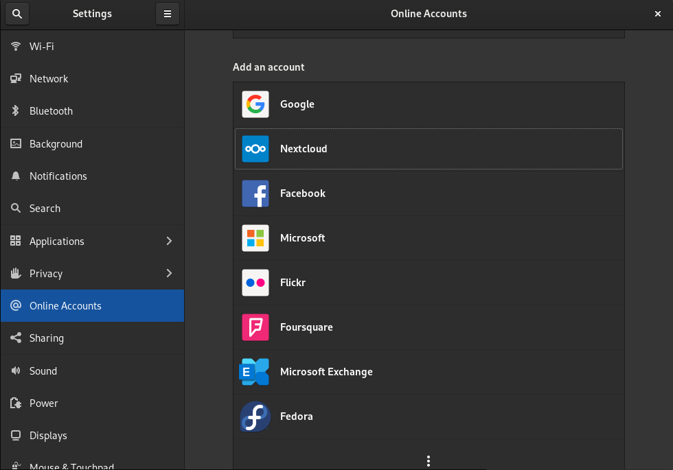

# Versió 5
## Màquina real

S'implementa la configuració del contenidor de la Versió 4 a una màquina real per
comprovar i avaluar el funcionament del Nextcloud.

Ubuntu 20.04 LTS és la distribució elegida per Nextcloud a l'hora d'avaluar
la comunitat, l'estabilitat i la comoditat del sistema.

Primer de tot, vam seguir els passos de instal·lar un Ubuntu minimal sense repositoris
de tercers amb l'usuari local **guest**. Després d'instal·lar **vim** i **git**, vam seguir les comandes del Dockerfile
un cop havent clonat el repositori per tenir tots els paquets necessaris per al correcte funcionament del Nextcloud:

```
sudo apt upgrade && apt update
sudo apt -y install apt-utils aptitude vim wget nmap iproute2 less curl gpg apache2 mariadb-server pv
apt -y install libapache2-mod-php7.4 php7.4-gd php7.4-mysql php7.4-curl php7.4-mbstring php7.4-intl php7.4-gmp php7.4-bcmath php-imagick php7.4-xml php7.4-zip
```

Després, s'executen les ordres del 'startup.sh'. Es pot fer de dos formes:

- Copiar i enganxar les ordres del script.
- Executar el script.

Si volem executar el script, hauríem de copiar el contingut del repositori de la
Versió 4 a un nou directori `/opt/docker` i, sent aquest el directori actiu, executar el script
amb permisos d'administrador:

```
sudo chmod +x startup.sh
sudo ./startup.sh
```

Un cop finalitzat tot el procés, per comprovar el funcionament, necessitàvem un altre equip per actuar de client.
Ja que la publicació del servidor està limitada a la xarxa local, en aquest cas, l'aula N2I, els equips elegits són l'i16 i l'i18, equips de l'Andreu i del Carles respectivament.

Abans ens hem d'assegurar d'haver importat el certificat d'autoritat pertinent al sistema i al Navegador. Per importar el certificat al sistema, ens l'hem de
copiar a `etc/pki/ca-trust/source/anchors/` i executar `update-ca-trust`, tal com diu el **README** dintre del directori `etc/pki/ca-trust/source/`:

```t
This directory /etc/pki/ca-trust/source/ contains CA certificates and
trust settings in the PEM file format. The trust settings found here will be
interpreted with a high priority - higher than the ones found in
/usr/share/pki/ca-trust-source/.

=============================================================================
QUICK HELP: To add a certificate in the simple PEM or DER file formats to the
list of CAs trusted on the system:

Copy it to the
/etc/pki/ca-trust/source/anchors/
subdirectory, and run the
update-ca-trust
command.

If your certificate is in the extended BEGIN TRUSTED file format,
then place it into the main source/ directory instead.
=============================================================================

Please refer to the update-ca-trust(8) manual page for additional information.

```

Cal destacar que només hi ha un usuari administrador, però més d'un usuari pot estar amb sessió iniciada a l'administrador.
Això és un aspecte positiu ja que en cas d'aplicació en entorn real, la resolució d'incidències i les tasques administratives es poden
realitzar de forma simultània.

Un cop es pot garantir l'accés al servidor, donem per conclosa la prova amb resultat d'èxit. La creació i edició de documents
amb els aplicatius *Collabora* i *Onlyoffice* també va ser possible.

Per millorar l'experiència dels usuaris, es va afegir l'aplicació **Talk** per permetre la comunicació entre els usuaris del servidor.
Talk incorpora missatgeria instantània, transferència d'arxius i trucades.

Després, es va incorporar l'usuari local de prova **Mati** sense permisos d'administrador per fer una segona prova.
Mati va ser capaç de crear, editar, compartir i eliminar un full de càlcul, un document de text i una presentació amb les dos aplicacions.

La tercera prova implicava iniciar sessió amb un usuari sense permisos d'administrador per poder iniciar sessió via preferències del sistema, comptes en línia:



Haurem d'indicar el servidor (https://www.edt.nextcloud.org), l'usuari i la contrasenya.

Quan s'hagi iniciat sessió, ens demanarà què volem sincronitzar. Tenim tres funcionalitats que es poden sincronitzar entre
el servidor de Nextcloud i el sistema:

- Contactes: Els contactes del Nextcloud apareixeran a l'aplicació del GNOME *Contacts*.
- Calendari: Els events del calendari seran sincronitzats amb *Calendar*.
- Arxius: El Nautilus crearà un nou accés per poder accedir al nostre "*home*" del Nextcloud. També es mostrarà i s'actualitzaran les carpetes
que s'han sincronitzat amb el compte.


