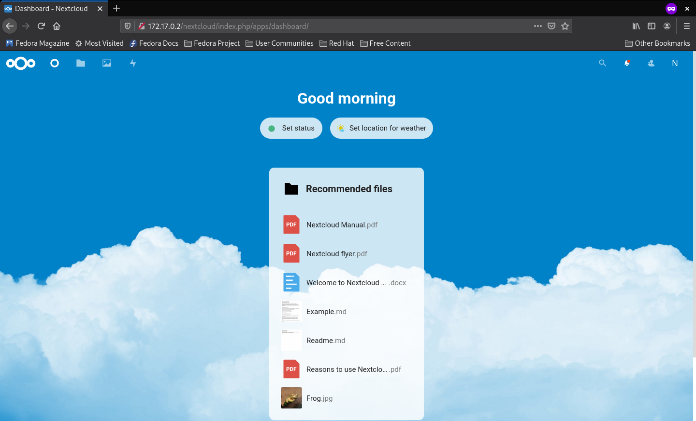
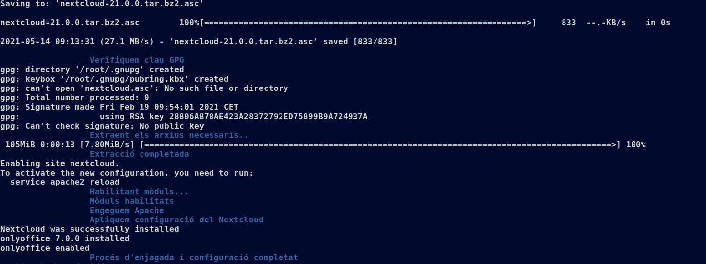
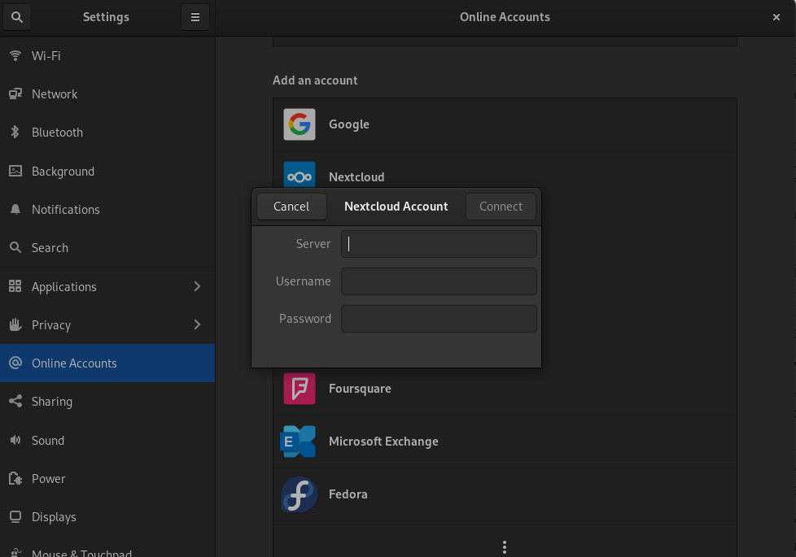
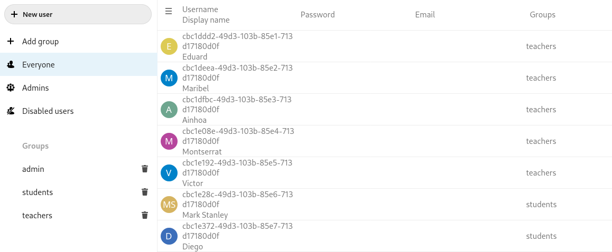
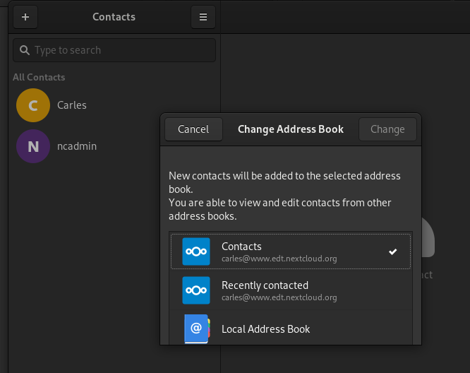

# Qui som


# Què és Nextcloud?


# Per què utilitzar Nextcloud?

- Codi obert
- Núvol propi
- Fàcil gestió
- Varietat d'aplicacions

# Collabora: L'editor de text derivat de LibreOffice


# Collabora: L'editor de text derivat de LibreOffice

- Codi obert
- *Development edition* en continu desenvolupament
- Des del navegador i dispositius mòbils

# Onlyoffice: La suite completa de productivitat


# Onlyoffice: La suite compleda de productivitat

- *Community edition* de codi obert
- Compatibilitat de formats
- Cooperació

# Versió 1 del servidor
## Servidor Nextcloud bàsic

# Versió 1 del servidor

[**Manual de l'administrador**](https://docs.nextcloud.com/server/stable/admin_manual/)

# Versió 1 del servidor
## El Startup

1. Virtualhost
1. MariaDB
1. Fitxers: descàrrega i extracció
1. Permisos i serveis

# Versió 1 del servidor
## El Dashboard




# Versió 2 del servidor
## Autoconfiguració i Onlyoffice

# Versió 2 del servidor
## OCC: Aplicacions

Fitxer occ\_apps:
```
/usr/bin/php /var/www/nextcloud/occ maintenance:install --database \
"mysql" --database-name "nextcloud" --database-user "ncadmin" --database-pass \
"XXXX" --admin-user "ncadmin" --admin-pass "XXXX"

/usr/bin/php /var/www/nextcloud/occ app:install onlyoffice
```
Execució:

```
su www-data -s /bin/bash -c '/opt/docker/occ_apps.sh'
```

# Versió 2 del servidor
## Contenidor del servidor de documents

```
sudo docker run -i -t -d -p 80:80 --restart=always onlyoffice/documentserver
```
# Versió 2 del servidor
## Colors, missatges, identació



# Versió 3 del servidor
## Configuració HTTPS i intent de Onlyoffice

# Versió 3 del servidor
## Importar un certificat al navegador

1. Obrir el navegador i anar a la configuració.
1. Accedir al apartat de privacitat i seguretat.
1. Baixar fins on diu certificats i donar-li a __Veure certificats__.
1. A l'apartat de autoritats, importar la CA.pem que ens permet que el navegador reconegui el certificat.

# Versió 3 del servidor
## SSL al VirtualHost

```
  SSLEngine On
  SSLProtocol all -SSLv3
  SSLCertificateKeyFile /var/www/certs/serverkey.pem
  SSLCertificateFile /var/www/certs/server.pem
```

```
  DocumentRoot /var/www/nextcloud/
  ServerName  www.edt.nextcloud.org
  serverAdmin cgrillo172@gmail.com
  serveralias edt.nextcloud.org
```

# Versió 3 del servidor
## Canvis a config.php

`/var/www/nextcloud/config/config.php`:
```
 'trusted_domains' => 
  array (
	  0 => 'localhost',
	  1 => 'www.edt.nextcloud.org',
  ),
```

# Versió 3 del servidor
## Canvis al startup.sh

```
mkdir /var/www/certs
cp -r /opt/docker/server.pem /var/www/certs
cp -r /opt/docker/serverkey.pem /var/www/certs
```

```
a2dissite 000-default.conf
```

```
cp /opt/docker/config.php /var/www/nextcloud/config/config.php
```
# Versió 3 del servidor
## Prova d'onlyoffice

- Mitjançant un contenidor

```
docker run -i -t -d -p 80:80 --restart=always onlyoffice/documentserver
```

- Instal·lació via git

```
cd /var/www/nextcloud/apps
git clone https://github.com/ONLYOFFICE/onlyoffice-nextcloud.git onlyoffice
chown -R www-data:www-data onlyoffice
```

# Versió 4 del servidor
## Solucions i millores

# Versió 4 del servidor
## apache\_php.ini, cli\_php.ini

```
post_max_size = 1G
memory_limit = 1G
```

# Versió 4 del servidor
## Addició del servidor de documents al llistat d'aplicacions

```
/usr/bin/php /var/www/nextcloud/occ app:install documentserver_community
```

# Versió 5 del servidor
## Implementació a un host real

- Ubuntu 20.04 LTS
- usuari local **guest**
- Ordinador i17

# Versió 5 del servidor
## Imitació del comportament del contenidor

```
sudo apt upgrade && apt update
sudo apt -y install apt-utils aptitude vim wget nmap iproute2 less curl gpg apache2 mariadb-server pv
apt -y install libapache2-mod-php7.4 php7.4-gd php7.4-mysql php7.4-curl php7.4-mbstring php7.4-intl php7.4-gmp php7.4-bcmath php-imagick php7.4-xml php7.4-zip
```

```
sudo chmod +x startup.sh
sudo ./startup.sh
```

# Versió 5 del servidor
## Importació de la CA al sistema

```
cp CA.pem /etc/pki/ca-trust/source/anchors/
update-ca-trust
```

# Versió 5 del servidor
## Prova 



# Autenticació d'usuaris amb LDAP
## Contingut dels fitxers (1)

ldap.conf
```
BASE	dc=edt,dc=nextcloud,dc=org
URI	ldap://localhost
```

# Autenticació d'usuaris amb LDAP
## Contingut dels fitxers (1)

slapd.conf
```
TLSCACertificateFile        /etc/openldap/certs/CA.pem
TLSCertificateFile          /etc/openldap/certs/server.pem
TLSCertificateKeyFile       /etc/openldap/certs/serverkey.pem
```
```
database mdb
suffix "dc=edt,dc=nextcloud,dc=org"
rootdn "cn=Manager,dc=edt,dc=nextcloud,dc=org"
rootpw {SSHA}JGzCfrm+TvKfHtbpjPdz3YCVYpqUbTVY
directory /var/lib/ldap
index objectClass eq,pres
access to * by self write by * read
```
# Autenticació d'usuaris amb LDAP
## Contingut dels fitxers (3)

```
dn: uid=eduard,ou=users,dc=edt,dc=nextcloud,dc=org
objectclass: posixAccount
objectclass: inetOrgPerson
cn: Eduard
sn: Canet
ou: users
uid: eduard
uidNumber: 5201
gidNumber: 602
homeDirectory: /tmp/home/eduard
userPassword: {SSHA}4Dw7GeOzkjqAt92EGghrOeiDGoPZRBOs
```

# Autenticació d'usuaris amb LDAP
## Contingut dels fitxers (3)


```
dn: uid=javier,ou=users,dc=edt,dc=nextcloud,dc=org
objectclass: posixAccount
objectclass: inetOrgPerson
cn: Javier
sn: Moyano
ou: users
uid: javier
uidNumber: 5004
gidNumber: 601
homeDirectory: /tmp/home/javier
userPassword: {SSHA}wmNL/oBT0SjziTg64seJbuHI8CqB+WnW

```

# Autenticació d'usuaris amb LDAP
## Contingut dels fitxers (4)

```
dn: cn=students,ou=groups,dc=edt,dc=nextcloud,dc=org
cn: students
gidNumber: 601
description: Grup d'alumnes
memberUid: mark
memberUid: christian
memberUid: diego
memberUid: javier
memberUid: roberto
memberUid: alejandro
memberUid: mati
memberUid: carles
memberUid: andreu
memberUid: hicham
objectclass: posixGroup
```

## Autenticació d'usuaris amb LDAP



# Comparació entre Nextcloud i Google


# Sincronització, Nextcloud i Google



# Acabem
## Conclusions

# Acabem
## Gràcies!

*2HISIX, Administració de Sistemes Informàtics en Xarxa, Escola del Treball, Curs 2020-2021*
