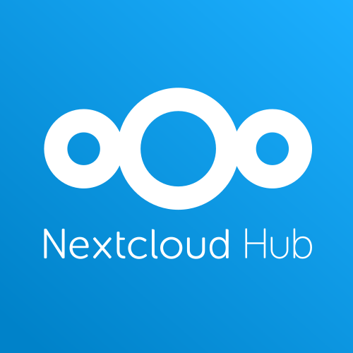

# Nextcloud amb Collabora i Onlyoffice

*Andreu Pasalamar Carbó*

*Carles Grilló Oller*

## Índex

1. [Què és Nextcloud?](#quees)

2. [Collabora](#colla)

3. [Onlyoffice](#only)

## Què és Nextcloud?

Nextcloud és un aplicatiu per compartir i sincronitzar arxius amb la
característica de que el pots instalar a un servidor propi. Pots compartir múltiples
directoris i fitxers, i inmediatament es sincronitzen al servidor i a la resta de dispositius.

Es pot accedir al Nextcloud des de la direcció del servidor, afegint el compte de Nextcloud a
un sistema GNU+Linux,des d'un aplicatiu per escriptori, des d'Android i des d'un dispositiu iOS

## Per què utilitzar Nextcloud?

És una eina de codi obert i ofereix una molt bona alternativa a tenir documentació sensible al núvol,
a mans de serveis privatius. A més, es de fàcil gestió per part de l'administrador i conté aplicacions
internes de molts tipus, variant entre eines comunicatives, edició d'arxius i oci.

## Collabora. L'editor de text derivat de LibreOffice

Collabora és un packet d'editors col·laboratius per treballar amb documents, fulls de càlcul i
presentacions de diferents formats. És de codi obert, segur i allotjat al propi servidor del Nextcloud.

*Collabora Development Edition* és gratuït, però està en continu desenvolupament i no està garantitzat
que sigui estable.

L'eina es pot utilitzar des del navegador i dispositius mòbils.

## Onlyoffice: La suite completa de productivitat

Onlyoffice és, com Collabra, un paquet d'editors de documents, fulls de càlcul i presentacions. La
*Community edition* és de codi obert. 

L'aplicació està caracteritzada per poder editar documents en format de la suite d'Office de Microsoft,
així no cal anar canviant d'aplicacions. 

La suite està completament preparada per què un equip treballe de forma coordinada sobre un document.

