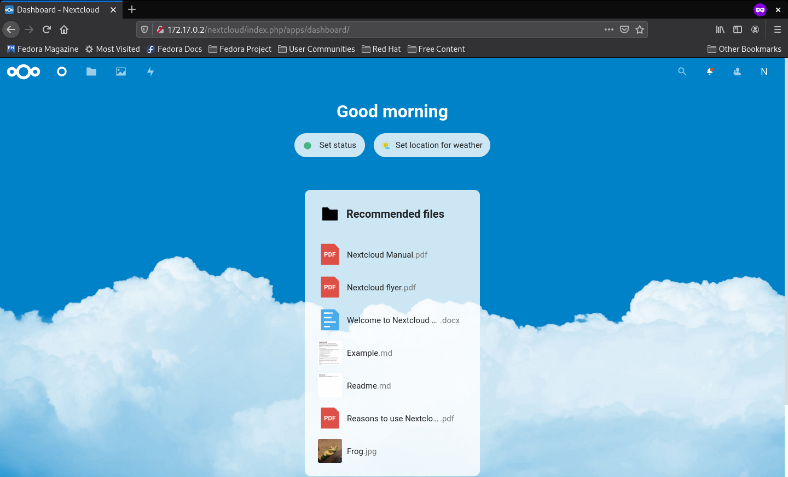

# Versió 1 del servidor

## Servidor Nextcloud bàsic

El primer pas és fer una instalació del servidor simple per veure com funciona
i familiaritzar-nos amb Nextcloud. El que hem fet ha estat seguir el manual
d'administrador que proporciona Nextcloud.

En la primera versió que provem utilitzem l'anomenat __LAMP stack__ (Linux, Apache,
MariaDB, PHP), tot això s'instala en un contenidor Ubuntu 20.04 LTS.

En el Dockerfile comencem per instal·lar utilitats.

~~~
RUN apt -y install apt-utils aptitude vim wget nmap iproute2 less curl gpg apache2 mariadb-server
~~~

 Després ja es comencen a instal·lar els programes necessaris mencionats abans per
al funcionament mínim del servidor Nextcloud.

~~~
RUN apt -y install libapache2-mod-php7.4 php7.4-gd php7.4-mysql php7.4-curl php7.4-mbstring php7.4-intl php7.4-gmp php7.4-bcmath php-imagick php7.4-xml php7.4-zip
~~~

El següent pas és crear el VirtualHost que ens donarà accés al servidor des del
navegador seguint l'exemple del manual es construeix el VirtualHost al fitxer
nextcloud.conf.

~~~
# Contingut del fitxer nextcloud.conf

Alias /nextcloud "/var/www/nextcloud/"

<Directory /var/www/nextcloud/>
  Require all granted
  AllowOverride All
  Options FollowSymLinks MultiViews

  <IfModule mod_dav.c>
    Dav off
  </IfModule>

</Directory>
~~~

Un cop creat el fitxer del VirtualHost ja creem el script startup.sh que farà tot
el procés d'instal·lació. Al startup el primer pas és posar el fitxer nextcloud.conf
que conté el VirtualHost al directori _/etc/apache2/sites-available_ i activar-lo
amb l'ordre __a2ensite__.

~~~
cp /opt/docker/nextcloud.conf /etc/apache2/sites-available/

a2ensite nextcloud.conf
~~~

A continuació s'engega el MariaDB on al probar-lo per primera vegada ens trobem
que hi ha molta configuració que s'ha de fer durant l'execució del startup i per tant
s'ha de crear un altre arxiu anomenat sqlconfig.sql on es crea un usuari, la database
i se li donen tots els privilegis sobre la database a l'usuari acabat de crear.

~~~
# Al executar la següent comanda és quan ens demana la cnfiguració

/etc/init.d/mysql start
~~~

~~~
# Contingut del fitxer sqlconfig.sh

CREATE USER 'ncadmin'@'localhost' IDENTIFIED BY 'jupiter';
CREATE DATABASE IF NOT EXISTS nextcloud CHARACTER SET utf8mb4 COLLATE utf8mb4_general_ci;
GRANT ALL PRIVILEGES ON nextcloud.* TO 'ncadmin'@'localhost';
FLUSH PRIVILEGES;
~~~

~~~
# Continuació del fitxer startup.sh un cop es té el fitxer sqlconfig.sql

mysql -u root < sqlconfig.sql

echo "root:jupiter" | chpasswd
~~~

Un cop solucionat aquest problema d'automatització continuem provant el startup,
es fa un wget del paquet Nextcloud referent a la versió 21 .sha256, es verifica
el SHA256sum, es fa el mateix amb el paquet .asc i la verificació amb gpg.

~~~
# Linies corresponents a la descarrega dels paquets i les respectives confirmacions

wget https://download.nextcloud.com/server/releases/nextcloud-21.0.0.tar.bz2.sha256
sha256sum -c nextcloud-21.0.0.tar.bz2.sha256 < nextcloud-21.0.0.tar.bz2

wget https://download.nextcloud.com/server/releases/nextcloud-21.0.0.tar.bz2
wget https://download.nextcloud.com/server/releases/nextcloud-21.0.0.tar.bz2.asc
wget https://nextcloud.com/nextcloud.asc

gpg --import nextcloud.asc
gpg --verify nextcloud-21.0.0.tar.bz2.asc nextcloud-21.0.0.tar.bz2
~~~

Un cop fetes totes les verificacions es fa un tar del paquet per descomprimir-lo,
un cop acabat el tar es copia tot el directori que s'acaba de crear al direcori
__/var/www/__, a aquest directori li fan falta dos modificacions més, primer cal
fer-li un chmod de 775 i un chown a l'usuari i grup www-data.

~~~
tar -xjvf nextcloud-21.0.0.tar.bz2

cp -r nextcloud /var/www

chmod 775 -R /var/www/nextcloud/
chown www-data:www-data /var/www/nextcloud/ -R

service apache2 start
~~~

Una ultima cosa a afegir és la zona horaria que es demana durant la instal·lació i
per tant al Dockerfile s'afegeix una linia que crea un link simbòlic de
__/usr/share/zoneinfo/Europe/Madrid__ a __/etc/localtime__ i d'aquesta manera ja
només cal reiniciar el servei apache2.

~~~
# Linia del Dockerfile que estableix la zona horaria

RUN ln -s /usr/share/zoneinfo/Europe/Madrid /etc/localtime
~~~

Ara el servidor ja està instal·lat i està operatiu, només cal editar el fitxer
_/etc/hosts_ afegint la ip del docker i l'alias indicat al fitxer del VirtualHost.

~~~
# Part de fitxer /etc/hosts on per la ip localhost s'afegeix el nom alies indicat al fitxer nextcloud.conf

127.0.0.1   nextcloud localhost localhost.localdomain localhost4 localhost4.localdomain4
~~~

Amb aquesta instal·lació del servidor Nextcloud per accedir a través del navegador
caldra posar __"*ip del docker*"/nextcloud__ això porta a una pàgina on demanarà
crear l'usuari administrador, la base de dades i a quin directori es guardaran les
dades.

 Imatge de l'inici on demana crear l'ususari administrador i on es guarden les dades

 Imatge de la configuració de la base de dades

 Al acabar aquest procès apreix el login on
s'introdueixen les dades de l'administrador, en aquest cas __ncadmin__ i ja
entrarem al __Dashboard__ de l'usuari, a partir d'aquí l'usuari pot accedir
als seus fitxers, a la configuració del servidor, a la botiga d'aplicacions, etc.

 Imatge del dashboard