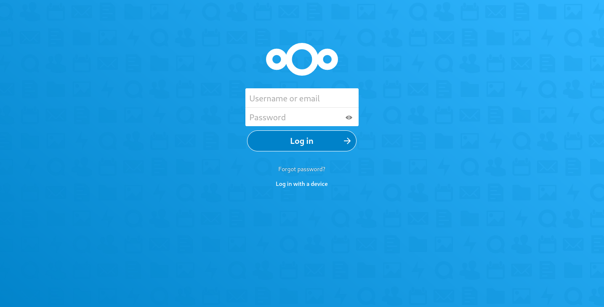
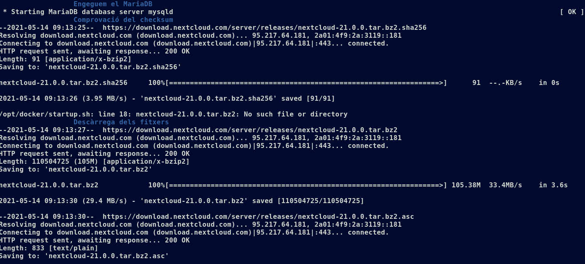
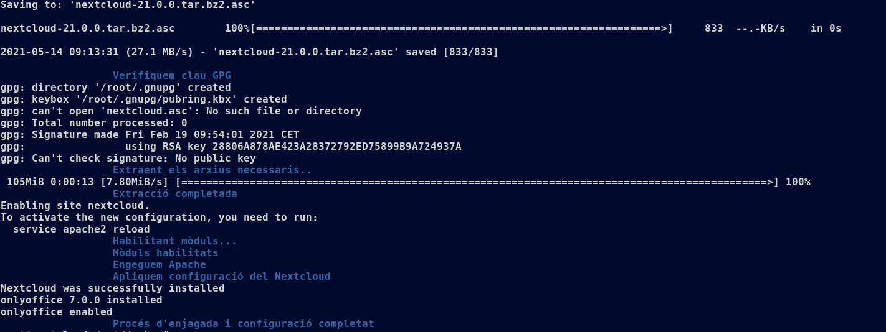

# Versió 2 del servidor

## Servidor Nextcloud Millorat

Un cop ens hem familiaritzat amb el funcionament del Nextcloud, podem estudiar de quina forma
es podria millorar el seu desplegament.

Un aspecte a destacar és la configuració manual que es realitza un cop instal·lat el Nextcloud. A la **Versió 1**,
s'ha de configurar manualment crear l'usuari administrador, la base de dades i el directori on es desen les dades.
Segons el manual de l'administrador:

> It is now possible to install Nextcloud entirely from the command line. This is convenient for scripted operations,
headless servers, and sysadmins who prefer the command line.

L'ordre que s'utilitza per fer la configuració via línia d'ordres és `occ`. El manual defineix la comanda de la següent forma:

> Nextcloud's occ command (origins from "ownCloud Console") is Nextcloud's command-line interface. You can perform many common server operations with occ, such as installing and upgrading Nextcloud, manage users, encryption, passwords, LDAP setting, and more.

> occ is in the nextcloud/ directory; for example /var/www/nextcloud on Ubuntu Linux. occ is a PHP script. You must run it as your HTTP user to ensure that the correct permissions are maintained on your Nextcloud files and directories.

Es remarca que s'ha d'executar com l'usuari del servei web, en el nostre cas, **www-data**. La comanda `occ` també permet instal·lar aplicacions
del Nextcloud, llavors podem aprofitar i fer un script amb la configuració del Nextcloud i l'aplicació que volíem provar, *Onlyoffice*. Aquest
script s'anomena *occ_apps.sh* i aquest és el seu contingut a la Versió 2:

```
/usr/bin/php /var/www/nextcloud/occ maintenance:install --database \
"mysql" --database-name "nextcloud" --database-user "ncadmin" --database-pass \
"XXXX" --admin-user "ncadmin" --admin-pass "XXXX"

/usr/bin/php /var/www/nextcloud/occ app:install onlyoffice
```
Repassem cadascuna de les parts del script. Al script tenim dues comandes a realitzar amb occ. Com l'executable es troba a
/var/www/nextcloud i s'ha d'executar amb php, posem les rutes absolutes. Després, 'maintenance:install' és l'ordre per realitzar la instalació
del servidor, i aquests són els seus arguments:

- `--database "mysql"`: Indica el tipus de base de dades.
- `--database-name "nextcloud"`: Aquest és el nom de la base de dades del Nextcloud.
- `--database-user "ncadmin"`: L`usuari administrador de la base de dades.
- `--database-pass "XXXX"`: La contrassenya de l'usuari administrador de la base de dades.
- `--admin-user "ncadmin"`: Usuari administrador del Nextcloud
- `--admin-pass "XXXX"`: Contrassenya de l'usuari administrador del Nextcloud

Un cop realitzada la instal·lació, ja podem realitzar comandes per afegir aplicacions. En aquest cas, utilitzarem l'ordre `app:install` per
obtenir l'*OnlyOffice*.

Aquest script l'executarem des de l'usuari del servei HTTP **www-data**. Per poder fer això, necessitarem ser administradors del servidor per poder executar comandes en el seu nom.
La comanda que tenim al *startup.sh* és la següent:

```
su www-data -s /bin/bash -c '/opt/docker/occ_apps.sh'
```

On `-s` indica la *shell* i `-c` la comanda.

Un cop acabada la instal·lació, ens mostrarà uns missatges per la sortida estàndard que indiquen que s'ha realitzat correctament:

```
Nextcloud was successfully installed
onlyoffice 7.0.0 installed
onlyoffice enabled
```

I només accedir a la direcció del servidor, ens demana iniciar sessió directament, i un cop dintre observem que tenim el *Onlyoffice*:




Com podem veure a la configuració, necessitem un Document Server. Segons el manual, el podem desplegar en un contenidor diferent,
assegurant que es pot comunicar amb el servidor. La comanda que ens proposen és aquesta:

```
sudo docker run -i -t -d -p 80:80 --restart=always onlyoffice/documentserver
```

Però a l'hora de provar-ho, no va donar molts bons resultats. Vam estar investigant per què no podíem encara així poder utilitzar el Document Server però no vam trobar una
solució vàlida. Llavors, vam intentar instal·lar el servidor des del llistat d'aplicacions del propi Nextcloud, així ja està integrat. Degut al pobre rendiment del contenidor, no
va ser possible una integració còmoda i versàtil. Vam decidir deixar la configuració del Document Server per més endavant.

Una altra modificació a la Versió 2, de menor rellevància, és l'addició de colors, missatges i línies de progrés a l'hora de desplegar el contenidor. Aquest és el seu aspecte:




Finalment, l'ordre per executar el contenidor, resultant amb una terminal al contenidor per millor administració del servidor, és:

```
# docker run --rm --name nextcloud -h nextcloud -p 80:80 -it andreupasalamar/nextcloud-server:v2
```