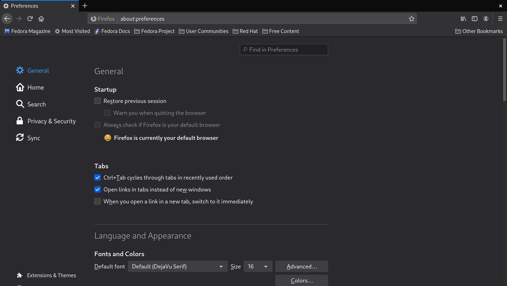
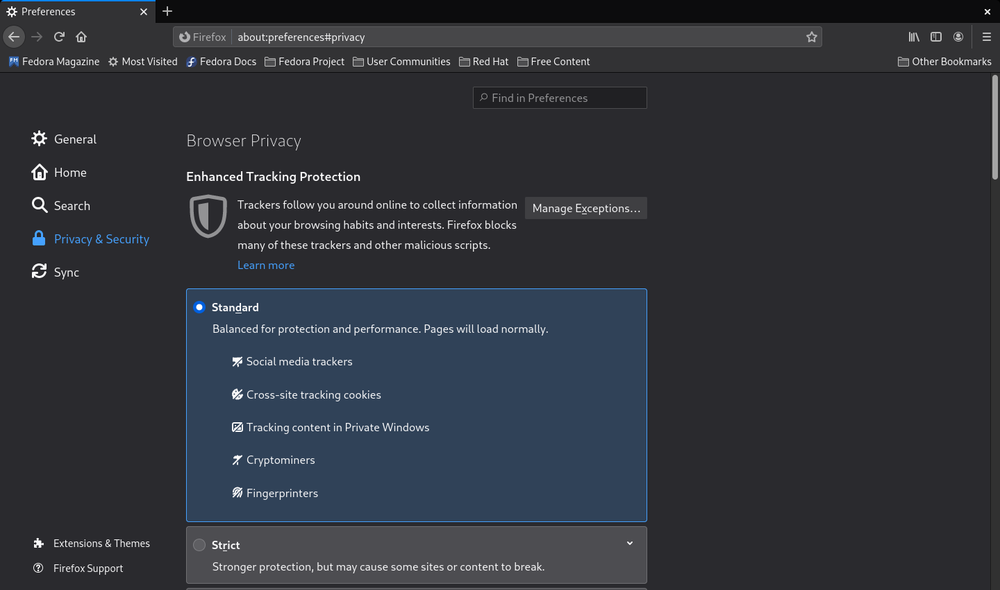
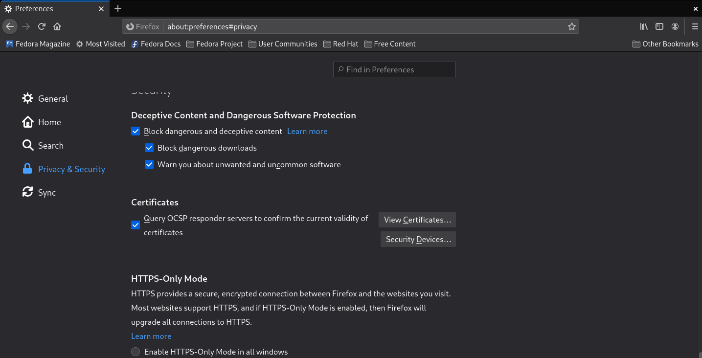
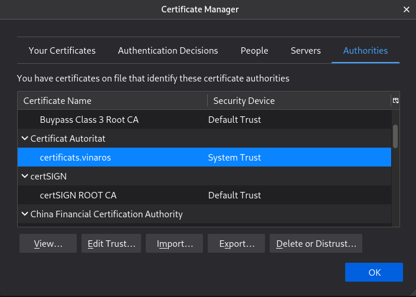

# Versió 3 del servidor

## Configuració HTTPS i intent de Onlyoffice

Un cop automatitzada la instal·lació en la versió anterior ara toca començar a complir
amb les directives del projecte i el primer que fem és convertir el servidor en segur.

El primer a provar és generar uns certificats autosignats ja que és ràpid i senzill,
però això provoca un problema i és que el navegador no accepta certificats autosignats,
així que es busquen alternatives a internet i en aquest moment ens comencem a plantejar
si la instal·lació que hem fet ha estat la millor manera ja que la gran majoria de guies
o posts al forum de nextcloud tracten el tema de fer el servidor segur havent fet la
instal·lació a través de __Snapd__, una eina que no dominem, però pel que es veu als
forums, bastant utilitzada. Decidim fer una petita prova de instal·lació per __Snapd__,
però no acabem d'entendre com funciona, ens falla i com ja tenim una instal·lació feta
i ens agrada com ha quedat.

Continuem buscant i veiem que utilitzant l'aplicació __Certbot__ es poden generar
certificats només posant el nom del domini que li hem possat al sevidor, però perquè
l'aplicació __Certbot__ crei els certificats per al domini introduit cal que aquest
domini estigui registrat d'alguna manera i nosaltres no tenim el domini registrat ja
que el servidor està instal·lat per utilitzar-lo només en local. És a dir, aquesta opció
tampoc ens val per a res així que tornem a la idea del principi, però aquesta vegada
enlloc de generar certificats autosignats, l'autoritat certificadora no tindra res a
veure amb els certificats del servidor. Al provar això veiem que ja tenim accés via
https al servidor, però l'autoritat certificadora no està reconeguda pel navegador
s'ha d'importar el certificat seguint els següents passos:
   

1. Obrir el navegador i anar a la configuració.

1. Accedir al apartat de privacitat i seguretat.

1. Baixar fins on diu certificats i donar-li a __Veure certificats__.

1. A l'apartat de autoritats, importar la CA.pem que ens permet que el navegador reconegui el certificat.

   

Per a poder accedir al servidor cal editar el fitxer nextcloud.conf per afegir la part
corresponent a l'activació SSL

~~~
  SSLEngine On
  SSLProtocol all -SSLv3
  SSLCertificateKeyFile /var/www/certs/serverkey.pem
  SSLCertificateFile /var/www/certs/server.pem
~~~
 

Respecte aquest fitxer també es canvien les línies corresponents a l'alias pel qual s'accedirà al servidor

~~~
  DocumentRoot /var/www/nextcloud/
  ServerName  www.edt.nextcloud.org
  serverAdmin cgrillo172@gmail.com
  serveralias edt.nextcloud.org
~~~

 

Al haver-li possat una URL com a alies al servidor, ara editar el fitxer */etc/hosts* ja
no és suficient i també cal editar un fitxer de dins del servidor anomenat *config.php*
on té un apartat anomenat *trusted_domains* que indica quins són els noms de domini que
reconeix i permet accedir al servidor.

Aquí està el fitxer config.php ubicat a */var/www/nextcloud/config/config.php*

~~~
<?php
$CONFIG = array (
  'passwordsalt' => 'WG8L1F23GOktRimygrdXwr4mhBiJL+',
  'secret' => 'DpkWcIG7arzbgOK98GGgkMjCHbGUF353hytE0rF9CVeJjcO0',
################################################################################
# Les següent línies són les que corresponen a quins dominis accepta el servidor
  'trusted_domains' => 
  array (
	  0 => 'localhost',
	  1 => 'www.edt.nextcloud.org',
  ),
################################################################################
  'datadirectory' => '/var/www/nextcloud/data',
  'dbtype' => 'mysql',
  'version' => '21.0.0.18',
  'overwrite.cli.url' => 'http://localhost',
  'dbname' => 'nextcloud',
  'dbhost' => 'localhost',
  'dbport' => '',
  'dbtableprefix' => 'oc_',
  'mysql.utf8mb4' => true,
  'dbuser' => 'ncadmin',
  'dbpassword' => 'jupiter',
  'installed' => true,
  'instanceid' => 'oczrw2ftq5am',
  'allow_local_remote_servers' => true,
);
~~~

Per automatitzar-ho tot, al startup.sh cal fer unes modificacions extres.

Creació del directori *certs* on aniran el certificats que permeten l'accés segur.

~~~
mkdir /var/www/certs
cp -r /opt/docker/server.pem /var/www/certs
cp -r /opt/docker/serverkey.pem /var/www/certs
~~~

Per assegurar-nos que s'entra al servidor Nextcloud i no a la pagina inicial d'apache
cal deshabilitar la configuració per defecte.

~~~
a2dissite 000-default.conf &> /dev/null
~~~

