# Comparar funcionalitats respecte Google Suite pel que fa a:

Google i Nextcloud pel que fa a la sincronització, són molt similars, permeten sincronitzar tot l'arbre de directoris que es tingui al servidor, els diversos calendaris que es puguin tenir, tant compartits (indiferentment si tu ets l'usuari que els ha creat o no) com personals, i també la llista de contactes.

  

En la següent imatge es pot veure el procés per connectar amb el servidor de Nextcloud, com en el nostre cas és local i té uns certificats autosignats, perquè el sistema reconegui la URL com a segura caldra afegir l'Autoritat Certificadora al sistema.

~~~
[root@localhost projecte-nextcloud]# cp newcerts/CA.pem /etc/pki/ca-trust/source/anchors/
[root@localhost projecte-nextcloud]# update-ca-trust
~~~

Un cop afegit el certificat la URL és reconeguda correctament i ja només cal introduir el *Username* i la *Password*

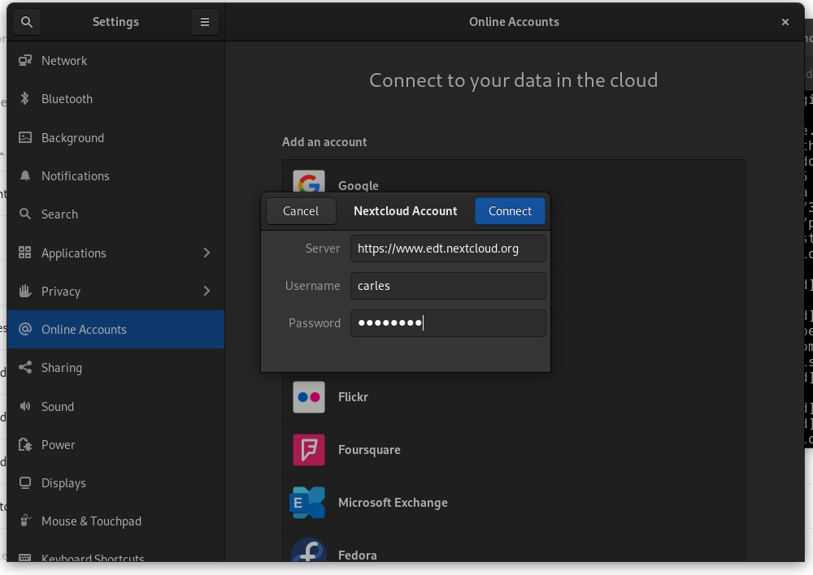

  

Un cop connecta amb el servidor, Fedora pregunta quines coses vols sincronitzar i les opcions són: calendari, contactes i fitxers.

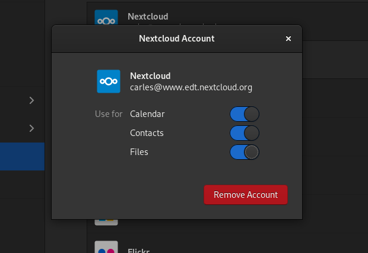

  

Igual que es fa per connectar amb el servidor de Nextcloud, es fa també per connectar-se amb Google, però aquí és més senzill perquè només cal iniciar sessió amb el compte de Gmail i ja és suficient.

En la següent imatge es pot observar com Google et permet a més del que ofereix Nextcloud sincronitzar el correu, les fotos i les impresores associades al teu compte.

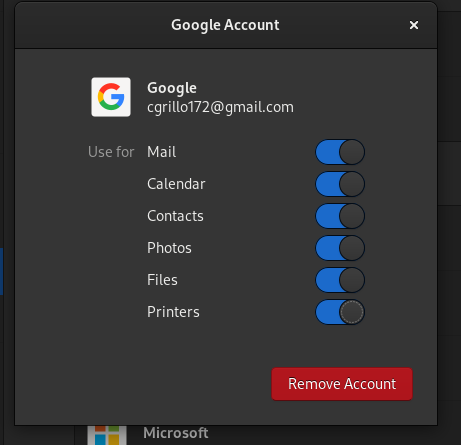

    

## Sincronització d’arxius (Google Drive)

Pel que fa a la sincronització d'arxius, que en el cas de Google seria els arxius i directoris de Google Drive, funcionen sense cap diferencia aparent, tots dos et donen accés als fitxers que tens al servidor i els canvis que es facin es veuran reflexats inmediatament al servidor.

Un cop introduits els dos comptes al sistema, quan s'obre el Nautilus es pot veure que apareixen els dos servidors com a accessibles, el de Google i el de Nextcloud.

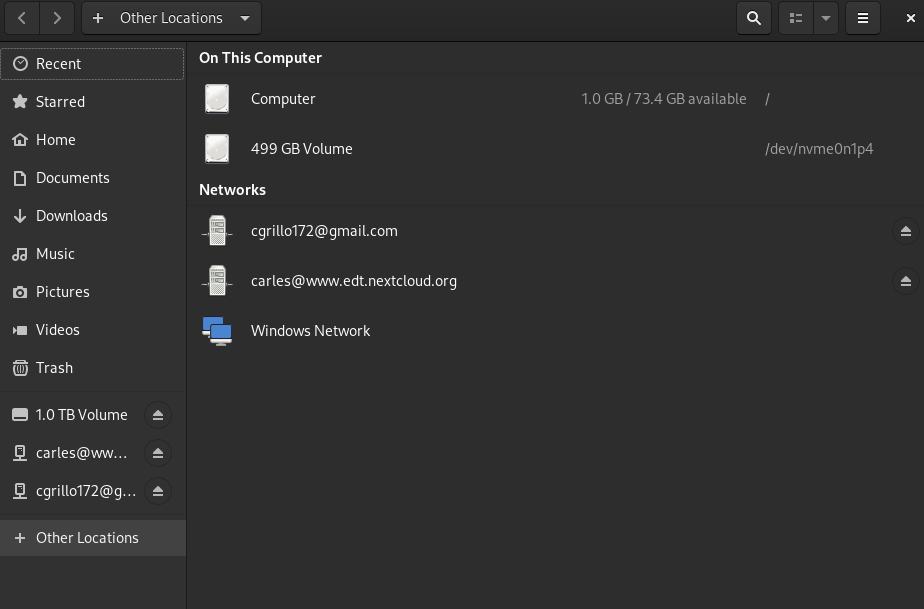

  

En la següent imagte es pot observar que estant dins del directori de Nextcloud creat a l'ordinador estan tots els fitxers i directoris que hi han al servidor.

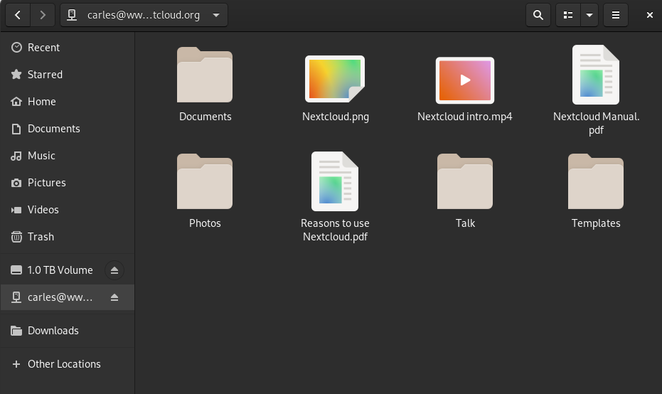

  

Igual amb la foto anterior, es veu que apareix el directori corresponent al drive del compte introduit amb tots els fitxers i directoris que s'hagin pujat per l'usuari, tot allò que sigui compartit però no creat per ell, no apareixe.

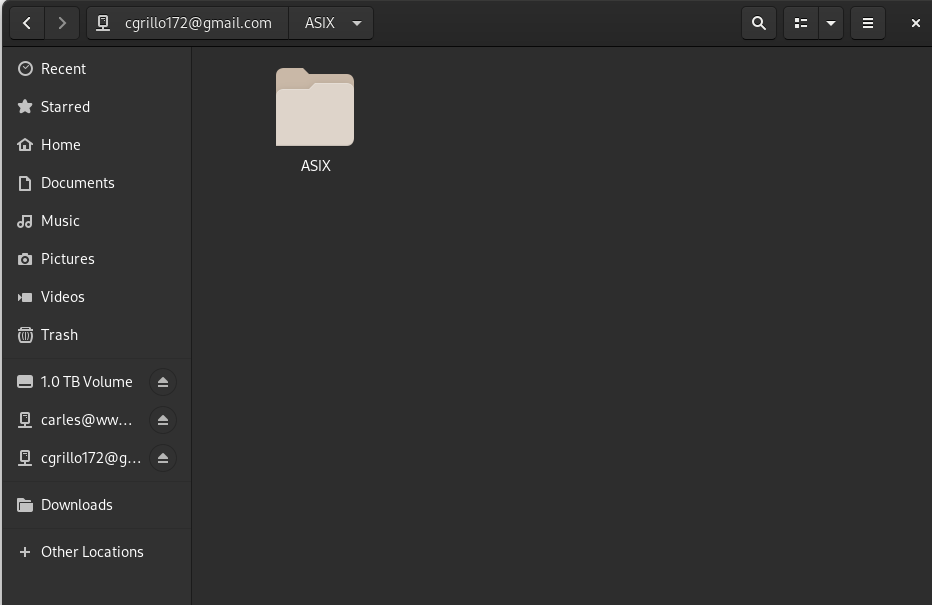

    

## Sincronització de calendaris

La sincronització de calendaris funciona igual tant en Nextcloud com en Google Calendar, tots els calendaris, propis o compartits amb tu són visibles i es poden realitzar canvis que després es veuen reflectits a les aplicacions.

A contiuació imatges de sincronització dels calendaris de Nextcloud.

En aquesta imatge es pot veure com l'usuari ***carles*** pot crear i editar un calendari que li ha compartit l'usuari ***ncadmin***

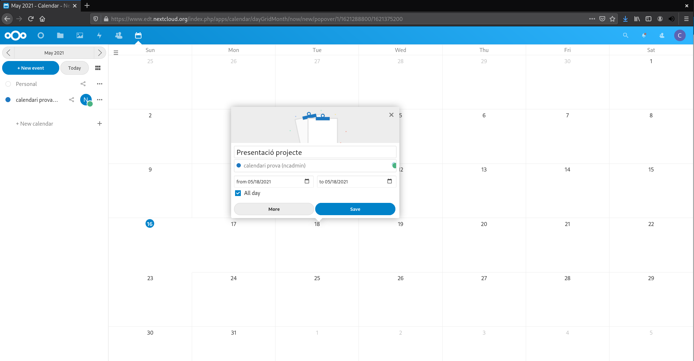

 

En aquesta imatge s'observa com en un calendari compartit els canvis efectuats per un usuari són visualitzats sense problema pels altres usuaris.

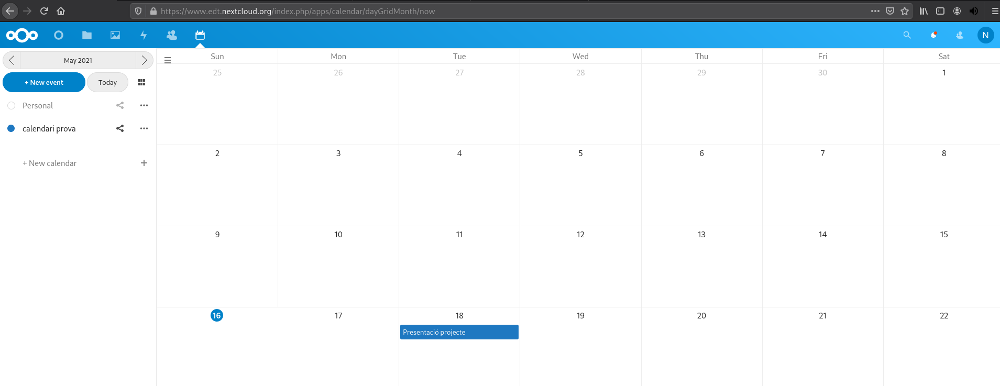

 

En la següent imatge es veu a l'aplicació *Calendar* del Fedora que els esdevenimets del calendari de Nextcloud són visibles al sistema.

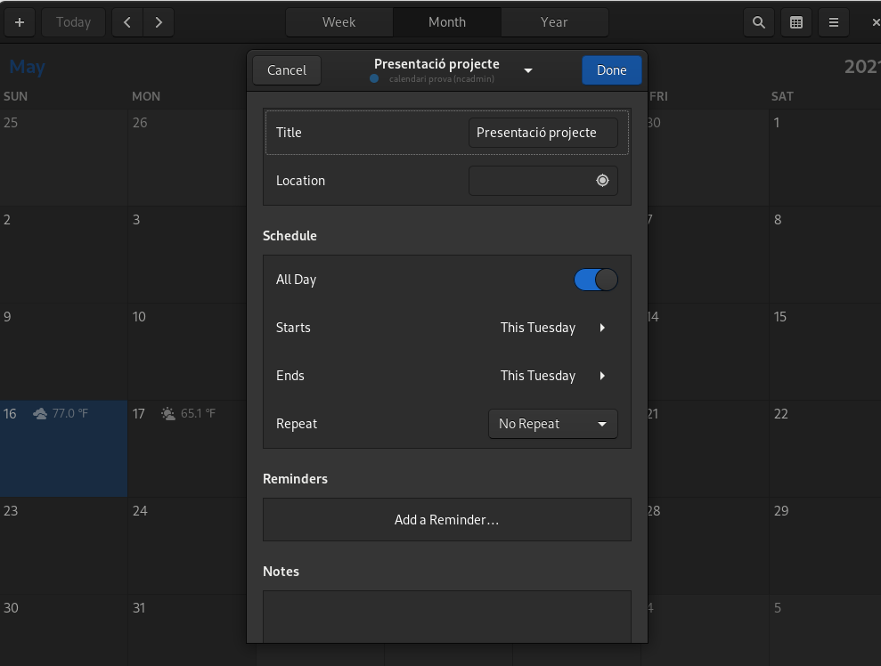

 

Ara si provem amb Google veiem que funciona exactament igual, els esdeveniments creats a *Google Calendar* es veuran reflectits a l'aplicació *Calendar* del sistema

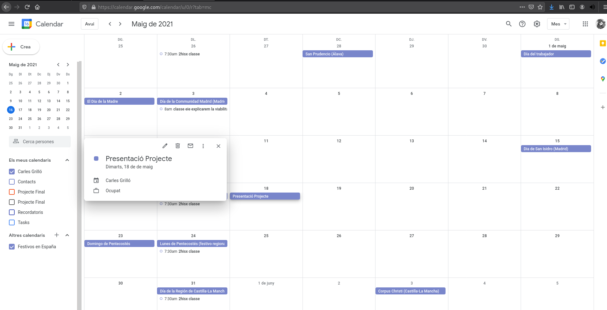

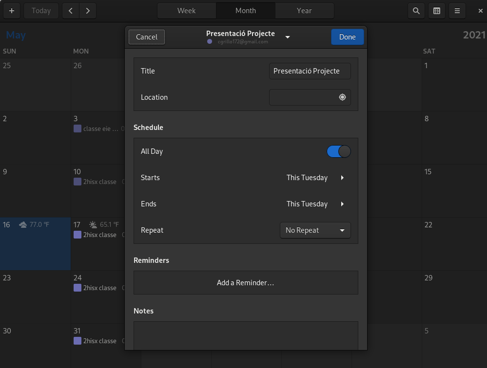

    

## Sincronització de contactes

Pel que fa als contactes, Nextcloud resulta una mica extrany mentre que Google et mostra aquells contactes del telèfon que tinguis guardats al núvol de Google i també de la gent amb qui has intercanviat correus, però Nextcloud tot i que també et mostra els contactes de la gent del servidor amb qui has intercanviat missatges, també permet afegir-ne de nous, cosa que no sembla gaire necessària ja que al no poder fer trucades telefòniques no té gaire sentit tenir contactes de fora del servidor, només en cas de ser un usuari que està connectat a Nextcloud tot el dia i vol tenir l'agenda de contactes al servidor simplement per comoditat.

A continuació una imatge de l'aplicació de contactes del sistema on es veuen els contactes amb els que s'ha interactuat.

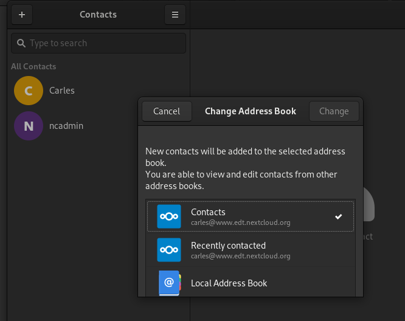

